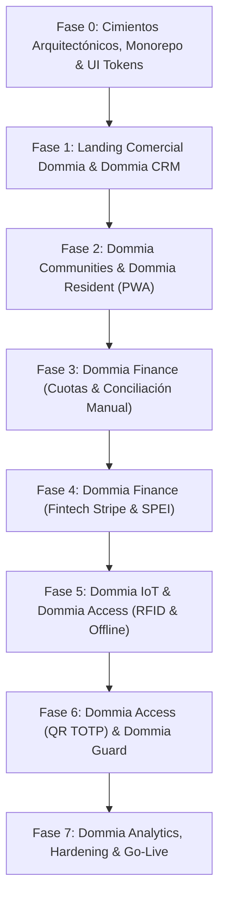

# 🚀 Plan de Desarrollo Maestro por Fases (Documento Vivo)
**Proyecto:** SaaS Modular para Fraccionamientos (DOMMIA)  
**Marca Principal:** DOMMIA  
**Producto Principal:** Dommia Communities  
**Tagline:** *El Sistema Operativo de tu Comunidad*  
**Versión:** 1.1.0  
**Última Actualización:** 2026-09-24  
**Estado:** Activo / En Evolución Continua

---

## 📌 Control de Versiones y Bitácora de Cambios
| Versión | Fecha | Autor / Agente | Descripción del Cambio |
| :--- | :---: | :--- | :--- |
| **1.0.0** | 2026-09-24 | Arquitectura & Pair Programmer | Creación del baseline integrando los 4 documentos iniciales de `/Docs` (Arquitectura C4, Anexo A, Recomendaciones y Plan Maestro v3). |
| **1.1.0** | 2026-09-24 | Arquitectura & Brand Alignment | Integración formal del Manual de Marca (`Saas Modular Frac Marca.md`), ecosistema de 8 productos (`Dommia Communities`, `Dommia CRM`, `Dommia Resident`, `Dommia Guard`, `Dommia Access`, `Dommia Finance`, `Dommia IoT`, `Dommia Analytics`), Design Tokens universales (Midnight Blue, Royal Blue, Inter, Manrope) y lineamientos de comunicación para el sitio web principal. |
| **1.2.0** | 2026-09-24 | Arquitectura & Pair Programmer | Expansión y formalización de **Dommia Guard**: Especificación como PWA Offline-First táctica para caseta de vigilancia, validación de QR con notificación al anfitrión, semáforo y auditoría de morosos, clasificador visual de placas de vehículos (LPR asistido) y canal de incidencias urgentes. |

---

## 🧭 Visión Global del Sistema: Ecosistema DOMMIA

**DOMMIA** (inspirado en *Domus* = Hogar) es la plataforma tecnológica que conecta administración, finanzas, seguridad, comunicación e infraestructura inteligente para comunidades residenciales modernas.

```
┌──────────────────────────────────────────────────────────────────────────────────────────────────┐
│                                     ECOSISTEMA DOMMIA                                            │
│                             "El Sistema Operativo de tu Comunidad"                               │
├────────────────────────────────┬─────────────────────────────────┬───────────────────────────────┤
│   1. DOMMIA CRM                │   2. DOMMIA COMMUNITIES         │   3. DOMMIA IOT & EDGE        │
│   (Backoffice del Operador)    │      (Portal Fraccionamiento)   │      (Infraestructura Caseta) │
├────────────────────────────────┼─────────────────────────────────┼───────────────────────────────┤
│ • Prospectos & Pipeline Ventas │ • Padrón de Residentes          │ • Dommia IoT Gateway (Edge)   │
│ • Suscripciones & Límites Plan │ • Catálogo de Propiedades       │ • Dommia Access (RFID/Wiegand)│
│ • Facturación Global SaaS      │ • Dommia Finance (Cuotas/Stripe)│ • Relevador Pluma (Contacto)  │
│ • Health Gateways (Telemetría) │ • Dommia Resident (PWA Offline) │ • SQLite Local Offline-First  │
│ • Aprovisionamiento de Tenants │ • Dommia Guard (Caseta Web)     │ • Sincronización Batch MQTT   │
│ • Inventario de Hardware       │ • Circulares & Avisos           │ • Buffer Circular Antifallos  │
└────────────────────────────────┴─────────────────────────────────┴───────────────────────────────┘
                                                 │
                                                 ▼
        ┌────────────────────────────────────────────────────────────────────────┐
        │                    NÚCLEO TECNOLÓGICO CLOUD & EDGE                     │
        ├────────────────────────────────────────────────────────────────────────┤
        │ • Backend: NestJS (Monolito Modular con Dominios Desacoplados)         │
        │ • Base de Datos Central: PostgreSQL 16 (Schemas Independientes)        │
        │ • Frontend Web & PWA: Next.js + React + Tailwind + Dexie.js (IndexedDB)│
        │ • Design System Centralizado: @dommia/ui (Midnight Blue & Royal Blue)   │
        │ • Comunicación IoT: MQTT Broker (EMQX con TLS y Certificados)          │
        │ • Almacenamiento Edge: SQLite en Gateway para validación física local  │
        │ • Cache/Escala: Redis (Pospuesto formalmente para etapa post-MVP)      │
        └────────────────────────────────────────────────────────────────────────┘
```

### Arquitectura de Productos Dommia
1. **Dommia Communities:** Portal operativo web principal para el Administrador del Fraccionamiento.
2. **Dommia CRM:** Backoffice comercial y de soporte exclusivo del operador del negocio SaaS.
3. **Dommia Resident:** Aplicación web progresiva (PWA Offline-First) para colonos y residentes.
4. **Dommia Guard:** Aplicación web progresiva (PWA Offline-First) táctica y de alto contraste para tablets y computadoras de caseta de vigilancia.
5. **Dommia Access:** Motor de validación de accesos vehiculares y peatonales (RFID UHF + QR Dinámico TOTP).
6. **Dommia Finance:** Motor contable de cuotas, recargos, conciliación bancaria y pasarela fintech Stripe.
7. **Dommia IoT:** Firmware y servicios distribuidos para Gateways en caseta con tolerancia a fallos.
8. **Dommia Analytics:** Tableros de control ejecutivos, financieros, operativos y de soporte.

---

## 🎨 Design System y Directrices de Marca DOMMIA

Todas las aplicaciones del ecosistema deberán consumir tokens centralizados de diseño definidos en `@dommia/ui`:

### Paleta de Colores
* **Corporativos:**
  * **Midnight Blue (Primario):** `#0F172A` (Bases, navegación, fondos oscuros, textos de alta jerarquía)
  * **Royal Blue (Secundario / Acento):** `#2563EB` (Botones primarios, enlaces, llamadas a la acción, acentos activos)
  * **Blanco:** `#FFFFFF` (Superficies de tarjetas, fondos limpios)
  * **Gris Base:** `#F8FAFC` (Fondos neutros de dashboards, paneles secundarios)
* **Funcionales:**
  * **Éxito (Acceso Permitido / Pago Conciliado):** `#10B981` (Emerald)
  * **Advertencia (Por Vencer / Gateway Inestable):** `#F59E0B` (Amber)
  * **Error (Acceso Denegado / Moroso / Falla Crítica):** `#DC2626` (Red)

### Tipografía Oficial
* **Principal (UI, lectura, datos, tablas, formularios):** `Inter`
* **Secundaria (Títulos, Headings, números de dashboard, Display):** `Manrope`

### Concepto de Isotipo / Logotipo
* Construcción geométrica basada en: **D + Hogar + Nodo Digital** (vivienda moderna conectada en red).

---

## 🛡️ Principios Arquitectónicos Inquebrantables
1. **PostgreSQL es la Única Fuente de Verdad:** Ninguna base de datos periférica (IndexedDB en navegador o SQLite en caseta) dictamina estados contables o de acceso definitivos.
2. **Multi-Tenancy por Schemas:** El aislamiento entre fraccionamientos se realiza mediante Schemas independientes de PostgreSQL (`tenant_<slug>`), mientras que el esquema `public` almacena catálogos maestros y datos globales del SaaS.
3. **Offline-First sin Redis en MVP (ADR-001):** La tolerancia a fallos de internet recae en **SQLite** (en caseta) e **IndexedDB + Service Workers** (en la PWA). Redis queda reservado para la etapa de escalamiento masivo (>50 fraccionamientos o >1000 usuarios concurrentes).
4. **Idempotencia Universal:** Todo registro generado en modo desconectado o webhook transaccional de Stripe viaja con un `UUID` inmutable para prevenir duplicados.
5. **Límites Duros por Nivel de Suscripción:** El sistema bloquea a nivel de API (`403 Forbidden`) cualquier intento de crear propiedades o habilitar módulos que excedan el paquete contratado.
6. **Consistencia de Marca & Experiencia Unificada:** Todo módulo del sistema debe reflejar simplicidad, seguridad, rapidez y modernidad visual sin tecnicismos innecesarios para el usuario final.

---

## 🗺️ Mapa de Fases de Desarrollo



---

## 📋 Detalle de Fases de Implementación

---

### 🧱 FASE 0: Cimientos Arquitectónicos, Monorepo y UI Tokens
**Objetivo:** Establecer la infraestructura del código, el motor multi-inquilino de PostgreSQL, la seguridad transversal y los tokens de diseño de la marca DOMMIA.

* **Estado:** `[x] Completada (2026-09-24)`
* **Dependencias:** Ninguna

#### Tareas Técnicas:
- [x] **Estructura del Monorepo (Turborepo + pnpm workspaces):**
  - `apps/api`: Backend principal NestJS (Monolito Modular con PostgreSQL dinámico).
  - `apps/crm-admin`: Frontend web Next.js 15 para **Dommia CRM** (puerto 3001).
  - `apps/portal-web`: Estructura base para **Dommia Communities** y **Dommia Resident**.
  - `packages/shared-types`: Interfaces DTO, enums y contratos de API compartidos (`@dommia/shared-types`).
  - `packages/ui`: Componentes y Design Tokens de la marca DOMMIA (`@dommia/ui`).
  - `packages/config-tailwind`: Preset compartido de Tailwind CSS con tokens oficiales.
  - `packages/config-typescript`: Configuraciones base de TypeScript.
- [x] **Design System & UI Tokens (`packages/ui`):**
  - Paleta oficial: Midnight Blue (`#0F172A`), Royal Blue (`#2563EB`), Blanco (`#FFFFFF`), Gris Base (`#F8FAFC`).
  - Variables de colores funcionales: Éxito (`#10B981`), Advertencia (`#F59E0B`), Error (`#DC2626`).
  - Configuración tipográfica de `Inter` y `Manrope`.
  - Componentes base creados: `Logo` (D + Hogar + Nodo Digital), `Button`, `Badge`, `Card`.
- [x] **Infraestructura Local Docker (`docker-compose.yml`):**
  - PostgreSQL 16 con extensiones uuid-ossp y pgcrypto en puerto 5432.
  - EMQX 5.8 (Broker MQTT para IoT con puertos 1883, 8883, 8083, 8084 y 18083 para Dashboard).
- [x] **Esquema Global PostgreSQL (`public`):**
  - Tablas operativas: `tenants`, `subscriptions`, `crm_prospects`, `gateway_inventory`, `audit_logs`.
- [x] **Módulo Dynamic Multi-Tenant en NestJS:**
  - `DatabaseService` con ejecución dinámica de `SET search_path = tenant_<slug>, public`.
  - Función almacenada `provision_tenant_schema` que crea automáticamente el esquema del tenant y sus 8 tablas hijas (`properties`, `residents`, `vehicles`, `rfid_tags`, `invitations`, `access_logs`, `financial_charges`, `financial_payments`).
  - Endpoints probados y verificados: `GET /api/v1/tenants`, `POST /api/v1/tenants`, `GET /api/v1/tenants/:slug/properties`, `POST /api/v1/tenants/:slug/properties`.
- [x] **Módulo de Seguridad y RBAC Transversal:**
  - Definición de los 7 roles en `@dommia/shared-types`: `SUPER_ADMIN`, `COMMERCIAL_EXEC`, `SUPPORT`, `TENANT_ADMIN`, `OPERATOR`, `GUARD`, `RESIDENT`.
- [x] **Criterios de Aceptación Verificados:**
  - `docker compose up -d` levanta y mantiene saludables PostgreSQL y EMQX.
  - Se probó el aprovisionamiento dinámico de `tenant_valle_real` en menos de 100 milisegundos con aislamiento total respecto a `tenant_demo`.
  - `@dommia/ui` exporta componentes y tokens corporativos consumidos con éxito por `apps/crm-admin`.

---

### 🏢 FASE 1: Landing Comercial Dommia & Dommia CRM (Backoffice)
**Objetivo:** Construir la presencia comercial pública de DOMMIA con su identidad corporativa y el panel de control del operador para gestionar prospectos, altas de fraccionamientos y monitoreo de hardware.

* **Estado:** `[x] Completada (2026-09-24)`
* **Dependencias:** Fase 0

#### Tareas Técnicas:
- [x] **Landing Page Pública Oficial (Next.js SSR/SSG en `apps/portal-web` - Puerto 3000):**
  - Aplicación de identidad visual DOMMIA: Isotipo oficial (D + Hogar + Nodo Digital), paleta Midnight Blue (`#0F172A`) y Royal Blue (`#2563EB`).
  - Tagline principal: *"El Sistema Operativo de tu Comunidad"*.
  - Mensaje de valor claro: Plataforma que conecta administración, finanzas, seguridad y tecnología.
  - Sección "Lo que SOMOS vs Lo que NO somos" y desglose del ecosistema de 8 productos.
  - Cotizador dinámico e interactivo por número de viviendas con cálculo y recomendación de Tiers en tiempo real (Básico, Estándar, Profesional, Enterprise).
  - **Formulario Dual de Adquisición:**
    1. **Solicitar Demostración (Venta Asistida / Enterprise):** Registra el prospecto como `LEAD` en el pipeline comercial de CRM (`POST /api/v1/crm/prospects`).
    2. **Contratar y Activar de Inmediato (Self-Service Zero-Touch):** Aprovisionamiento atómico e instantáneo (`POST /api/v1/crm/self-service-provision`) con creación del schema PostgreSQL, usuario administrador con hash bcrypt, suscripción y registro automático como deal `WON`.
  - **Blindaje y Protección de Propiedad Intelectual (Anti-Scraping / Anti-Clonado):**
    - Deshabilitación total de mapas de fuentes (`productionBrowserSourceMaps: false`) en todo el monorepo.
    - Supresión de firmas de servidor (`poweredByHeader: false`).
    - Cabeceras de seguridad estrictas (`X-Frame-Options: SAMEORIGIN/DENY`, `X-Content-Type-Options: nosniff`, `Referrer-Policy: strict-origin-when-cross-origin`).
    - Trampa Honeypot invisible (`website_anti_bot_trap`) que neutraliza bots y scrapers sin almacenar basura ni alertar al atacante.
    - Bloqueo y descarte de correos temporales/desechables (`mailinator`, `tempmail`, etc.) para proteger los entornos demo de reconocimiento anónimo.
    - Protocolo formal documentado en [Protocolo de Seguridad y Protección de Propiedad Intelectual](file:///Users/cesargarciaperianez/Documents/Curso%20Udemy/SaaS%20Dommia/Docs/Arquitectura/Protocolo%20de%20Seguridad%20y%20Proteccion%20de%20Propiedad%20Intelectual.md).
  - SEO técnico optimizado con Semantic HTML, Open Graph, Twitter Cards y Schema.org JSON-LD.
- [x] **Dommia CRM - Dashboard Ejecutivo (`apps/crm-admin` - Puerto 3001):**
  - Métricas clave en tiempo real: MRR ($15,960 MXN), ARR ($191,520 MXN), Churn rate (0.0%), Fraccionamientos activos (4), Casas totales administradas (505 viviendas).
  - Desglose financiero por Tiers contratados (Básico, Estándar, Profesional, Enterprise).
  - Botón de sincronización con contraste optimizado (`variant="dark-outline"`).
- [x] **Dommia CRM - Pipeline Comercial:**
  - Tablero Kanban interactivo con 5 etapas: `LEAD` -> `CONTACTED` -> `DEMO` -> `PROPOSAL` -> `WON`.
  - Avance y retroceso rápido de etapa con persistencia en base de datos (`PATCH /api/v1/crm/prospects/:id/stage`).
  - Botón directo en prospectos ganados para aprovisionar fraccionamiento pre-llenando sus datos.
- [x] **Dommia CRM - Aprovisionamiento de Fraccionamientos:**
  - Formulario de contratación: Razón social, subdominio (`{slug}.dommia.com`), límite de casas contratadas (límite duro), selección de módulos activos (Finanzas, QR Dinámico, RFID, Residentes PWA).
  - Creación automática del Schema en PostgreSQL (`provision_tenant_schema`) y aislamiento estricto verificado.
- [x] **Dommia CRM - Inventario y Telemetría IoT:**
  - Registro de Gateways con UUID único, firmware, notas y fraccionamiento vinculado (`POST /api/v1/crm/gateways`).
  - Detección dinámica de estado: 🟢 `ONLINE` si el último heartbeat fue hace &le; 90s, o 🔴 `ALERTA: OFFLINE` si excede los 90 segundos.
  - Endpoint de simulación de Heartbeat MQTT (`POST /api/v1/crm/gateways/:uuid/heartbeat`).

- [x] **Dommia CRM - Gestión Dinámica de Planes SaaS y Monetización:**
  - Nueva entidad y tabla `public.saas_plans` en PostgreSQL con catálogo de tiers (`BASIC`, `STANDARD`, `PROFESSIONAL`, `ENTERPRISE`), precios mensuales, topes de viviendas, módulos base y add-ons disponibles.
  - Tab 5 en CRM Maestro: **"Planes & Módulos"** (`apps/crm-admin`) para visualizar los 4 tiers y modal de edición en vivo sin alterar código ni reiniciar servicios.
  - Recálculo dinámico de MRR y ARR en el backend (`apps/api`) consultando directamente `public.saas_plans` y sumando ingresos recurrentes por add-ons contratados.
- [x] **Política de Dominios Adaptada al Modelo de Negocio:**
  - **Dominio Estándar Compartido:** `standar.dommia.com/{slug}` asignado por defecto en planes Básico, Estándar y Profesional sin costo extra.
  - **Add-on de Subdominio Personalizado:** Opción contratada (+ $490 MXN/mes) para habilitar `{slug}.dommia.com` en planes menores.
  - **Inclusión 100% Gratuita en Enterprise:** Subdominio propio `{slug}.dommia.com` bonificado automáticamente en el paquete Enterprise.
  - Reflejo del modelo en el Cotizador, Formulario de Auto-Activación y visualización diferenciada de etiquetas en el listado de fraccionamientos de CRM Maestro.

#### Criterios de Aceptación Verificados:
- Un prospecto que solicita demo se registra en el pipeline comercial de Dommia CRM en tiempo real bajo esquema blindado sin entrega de archivos ni credenciales desprotegidas.
- La contratación directa aprovisiona el condominio en menos de 100ms, generando credenciales encriptadas y cerrando la venta como `WON`.
- La activación de un fraccionamiento crea su esquema en base de datos (`tenant_<slug>`), asigna la URL de acceso correspondiente (`standar.dommia.com/{slug}` o subdominio personalizado) y aísla los datos por completo.
- Los precios, topes de viviendas y costos de add-ons de los planes SaaS son editables desde CRM Maestro y recalculan las finanzas (MRR/ARR) automáticamente.
- Si un Gateway pierde conexión por más de 90 segundos, Dommia CRM cambia dinámicamente su estado a `OFFLINE` y emite una alerta operativa.

---

### 🏘️ FASE 2: Dommia Communities (Portal Operativo) & Dommia Resident (PWA)
**Objetivo:** Desarrollar el portal de administración del fraccionamiento y la aplicación web progresiva para los residentes.

* **Estado:** `[x] Completada`
* **Dependencias:** Fase 0, Fase 1

- [x] **Catálogo de Propiedades con Bloqueo de Límite Duro:**
  - Creación de la aplicación dedicada **Dommia Communities** (`apps/communities-admin` - Puerto 3002).
  - Autenticación con `pgcrypto` para administradores de fraccionamiento (`POST /api/v1/auth/login`).
  - Registro de calles, manzanas, lotes y números de vivienda en el schema dedicado (`tenant_<slug>.properties`).
  - **Enforcement estricto en backend:** Si `total_propiedades >= limite_casas_permitidas`, rechazo automático con `409/403 LIMIT_EXCEEDED`.
  - **Frontend reactivo:** Barra de progreso de capacidad de licencias, indicador de ocupación en tiempo real y **Modal de Solicitud de Upgrade de Plan** con enlace directo a Dommia CRM cuando se alcanza el tope contratado.
  - Edición y eliminación de propiedades con liberación instantánea de espacios en la cuota permitida.
- [x] **Padrón de Residentes e Inquilinos & Registro Vehicular:**
  - **Estructura Multi-Tenant:** Tablas aisladas `residents` y `vehicles` en cada esquema `tenant_<slug>`.
  - **Clasificación de Residentes:** `OWNER` (Propietario residente), `TENANT` (Arrendatario / Inquilino), `FAMILY_MEMBER` (Familiar / Dependiente).
  - **Gestión de Titularidad:** Identificación de contacto titular principal (`is_primary`) para encabezados y recepción de notificaciones clave.
  - **Registro Vehicular:** Control de placas vehiculares, marca, modelo, color, vinculación obligatoria a vivienda y opcional a residente conductor.
  - **Backend API (`apps/api`):** Endpoints completos de listado, alta, edición y baja:
    - `/api/v1/tenants/:slug/residents` (con filtros y resolución de vivienda).
    - `/api/v1/tenants/:slug/vehicles` (con filtros y resolución de vivienda y habitante).
  - **Frontend Dommia Communities (`apps/communities-admin` - Puerto 3002):**
    - Pestaña **"Padrón de Residentes"** con tarjetas métricas, búsqueda en vivo, filtros por rol y modal de alta/edición con enlaces directos a WhatsApp y llamada telefónica.
    - Pestaña **"Control Vehicular"** con badges de placas estilo vehicular mexicano, marca, modelo y conductor asociado.
    - Interconexión contextual desde la pestaña **"Viviendas & Lotes"** con badges de conteo y accesos directos para registrar habitantes o autos a una casa en 1 clic.
- [x] **Adopción del Estándar de Arquitectura Frontend en 3 Capas (Completado en `communities-admin` y `crm-admin`):**
  - **Capa 1: Presentación (TSX):** Componentes visuales "tontos" sin llamadas a API directas, alimentados 100% por props tipadas (`apps/*/src/features/*/components/`).
  - **Capa 2: Lógica (Custom Hooks):** Lógica de estado (`useState`, `useEffect`, `useMemo`), validaciones, sincronización con API y manejadores de eventos desacoplados en hooks independientes (`apps/*/src/features/*/hooks/`).
  - **Capa 3: Estilos & Tokens:** Tokens consistentes mediante Tailwind CSS y `@dommia/ui` organizados para no saturar los flujos de renderizado.
  - **Orquestadores Raíz Delgados:**
    - `apps/communities-admin/src/app/page.tsx` reducido de ~2,900 líneas a menos de 280 líneas limpias y declarativas.
    - `apps/crm-admin/src/app/page.tsx` reducido de ~1,960 líneas a tan solo 137 líneas declarativas y desacopladas.
  - **Documento Rector:** [Estandar de Arquitectura Frontend - 3 Capas.md](file:///Users/cesargarciaperianez/Documents/Curso%20Udemy/SaaS%20Dommia/Docs/Arquitectura/Estandar%20de%20Arquitectura%20Frontend%20-%203%20Capas.md) incorporado en la suite de arquitectura oficial.
- [x] **Adopción del Estándar de Arquitectura Backend en 3 Capas por Dominio:**
  - **Capa 1: Transporte & Controladores (Controllers & DTOs):** Manejo exclusivo de rutas HTTP REST, validación estricta con `class-validator`, códigos de respuesta (`200`, `201`, `400`, `404`). Cero SQL, cero lógica de negocio.
  - **Capa 2: Lógica de Dominio (Services):** Reglas de negocio puras (enforcement de límite duro de casas, validación de correos duplicados, normalización de placas, cálculo financiero MRR/ARR, anti-bot).
  - **Capa 3: Acceso a Datos & Persistencia (Repositories):** Aislamiento de consultas SQL parametrizadas a PostgreSQL y manejo del `search_path` dinámico multi-tenant (`tenant_<slug>`).
  - **Modularización por Dominio:** Descomposición del "God Service" `tenants.service.ts` (>530 líneas) en módulos independientes: `tenants`, `properties`, `residents`, `vehicles`, `auth`, `crm`, `health`.
  - **Documento Rector:** [Estandar de Arquitectura Backend - 3 Capas.md](file:///Users/cesargarciaperianez/Documents/Curso%20Udemy/SaaS%20Dommia/Docs/Arquitectura/Estandar%20de%20Arquitectura%20Backend%20-%203%20Capas.md) incorporado en la suite de arquitectura oficial.
- [x] **Dommia Resident (PWA Offline-First como Aplicación Independiente en Monorepo - `apps/resident-pwa` - Puerto 3003):**
  - **Decisión Arquitectónica:** Creada como aplicación independiente en el monorepo en lugar de una sub-ruta embebida dentro de `communities-admin`. Esto garantiza:
    1. Scope aislado de Service Worker (`/`) sin interferencia de caché con el portal administrativo.
    2. Bundle ultraligero para redes móviles lentas (< 150 KB gzipped) sin librerías pesadas de escritorio ni gráficos.
    3. Seguridad y aislamiento de cookies/tokens de sesión entre el residente y el administrador.
    4. Cero fallas por caídas de internet en la entrada vehicular gracias a la filosofía 100% *Offline-First*.
  - **PWA Shell & Service Worker (`public/manifest.json`, `public/sw.js`):**
    - Manifest configurado con `display: standalone`, tema Midnight Blue (`#0B1120`), acento Emerald (`#10B981`) e iconos corporativos vectoriales SVG (192x192 y 512x512).
    - Service Worker nativo con estrategia dual: *Stale-While-Revalidate* para assets estáticos y *Cache-First* para fuentes y shell de la aplicación.
  - **Motor IndexedDB Tipado Sin Dependencias Externas (`src/lib/db.ts`):**
    - Implementación nativa sobre la API estándar de IndexedDB con esquema Dexie-compatible.
    - 4 almacenes de objetos dedicados: `profile`, `invitations`, `notices` y `syncQueue`.
  - **Generador de QR Dinámico TOTP Local (`src/lib/totp.ts`):**
    - Algoritmo de rotación de credenciales criptográficas cada 30 segundos totalmente ejecutado en el dispositivo del colono, compatible con lectores ópticos de caseta aun en modo avión o sin señal 4G/5G.
    - Simulación de apertura física de pluma/portón con feedback háptico y visual.
  - **Módulo de Pases e Invitaciones de Visita (`features/invitations/`):**
    - Generación offline de pases para visitas (un solo uso, recurrentes o servicios).
    - **Motor Gráfico de Tarjetas de Pase QR (`src/lib/passCardGenerator.ts`):** Renderizado en canvas HTML5 de alta resolución (640x960 px) que genera una tarjeta institucional con logo DOMMIA ACCESS, nombre del fraccionamiento, nombre del invitado, tipo de pase, código QR de alto contraste, fecha de vigencia y domicilio del anfitrión.
    - **Modal de Compartición Multicanal (`SharePassModal.tsx`):**
      1. *Compartir Imagen en WhatsApp / Sistema:* Web Share API Level 2 con adjunto directo de archivo binario `image/png`.
      2. *Copiar Imagen al Portapapeles:* Uso de `navigator.clipboard.write([ClipboardItem])` para pegar directamente la imagen con `Ctrl + V` en WhatsApp Web o Telegram Desktop.
      3. *Descargar PNG:* Guardado inmediato en la galería o descargas del dispositivo.
      4. *Texto WhatsApp:* Fallback de mensaje textual con enlace pre-formateado.
    - Cola de sincronización en segundo plano con backoff exponencial y jitter aleatorio (500ms - 2500ms) para mitigar el efecto *Thundering Herd* al reconectarse.
  - **Adopción Estricta de Arquitectura Frontend en 3 Capas:**
    - Capa de Presentación: `MobileTopBar`, `MobileTabBar`, `ResidentCard`, `DynamicQRModal`, `AccessGateButton`, `ActivePassesList`, `QuickInviteModal`, `NoticesFeed`, `ResidentFinanceCard`.
    - Capa de Lógica: Hooks desacoplados `useOnlineStatus`, `useDynamicQR`, `useInvitations`, `useNotices`.
    - Capa de Estilos: Tokens Tailwind corporativos (Midnight Blue, Emerald, Royal Blue).
    - Orquestador raíz `page.tsx` de solo 177 líneas y ningún componente supera las 202 líneas (cumplimiento total de la regla < 250 líneas).
- [x] **Módulo de Comunicación y Avisos (Completado en Backend, Admin y PWA):**
  - **Backend (`apps/api/src/modules/notices/`):**
    - Tabla `notices` aprovisionada por esquema de tenant (`tenant_<slug>.notices`) con soporte para título, cuerpo, categoría (`URGENT`, `MAINTENANCE`, `ASSEMBLY`, `GENERAL`), prioridad (`HIGH`, `MEDIUM`, `LOW`), firma del emisor, flags `is_pinned` e `is_published`.
    - Endpoints REST en 3 capas (`GET`, `POST`, `PUT`, `DELETE` en `/api/v1/tenants/:slug/notices`) con DTOs validados mediante `class-validator`.
  - **Frontend Administrativo (`apps/communities-admin`):**
    - Pestaña interactiva **"Comunicados & Circulares"** con conteo en vivo, barra de búsqueda en tiempo real y filtrado por categoría.
    - Modal de alta y edición con selector de prioridad, fijado superior (`is_pinned`) y confirmación de publicación.
  - **Frontend Residente (`apps/resident-pwa`):**
    - Feed móvil reactivo en pestaña dedicada con badges visuales clasificados por color según urgencia o tipo de circular.
    - Sincronización en línea bidireccional con fallback automático y persistencia en IndexedDB (`db.notices`) para lectura instantánea sin conexión.

#### Criterios de Aceptación:
- El administrador no puede registrar la casa `N+1` si el tier contratado es para `N` viviendas.
- Dommia Resident se instala correctamente en dispositivos móviles (iOS y Android) y abre de inmediato aun sin señal celular.

---

### 💵 FASE 3: Dommia Finance (Cuotas & Conciliación Manual)
**Objetivo:** Proveer a los administradores del fraccionamiento el control total de las finanzas comunitarias antes de integrar pasarelas automatizadas.

* **Estado:** `🟡 En curso`
* **Dependencias:** Fase 2

#### Tareas Técnicas:
- [x] **Configuración de Estructura de Cuotas (Completado en Backend & Admin):**
  - **Base de Datos & Esquema Tenant:** Tabla `fee_configurations` aprovisionada con soporte para cuotas ordinarias fijas (`FIXED_RECURRENT`), cuotas variables por metraje de lote m² (`VARIABLE_LOT_SIZE`) y cuotas extraordinarias (`EXTRAORDINARY`), reglas de recargos por mora (% o fijo), días de gracia y descuentos por pronto pago.
  - **Backend NestJS (`apps/api/src/modules/finance/`):** Módulo `FinanceModule` en 3 capas (`FeeConfigurationController`, `FeeConfigurationService`, `FeeConfigurationRepository`) con CRUD completo, validación con `class-validator` y endpoint de simulación de cobro lote por lote (`POST /api/v1/tenants/:slug/finance/fees/:id/simulate`).
  - **Frontend Administrativo (`apps/communities-admin`):** Pestaña "Finanzas & Cuotas" con KPI cards de resumen, buscador predictivo, filtrado por tipo, modal de creación/edición, switches reactivos de activación y modal de simulación de recaudación proyectada.
- [ ] **Motor de Cobranza Mensual:**
  - Tarea programada (Cron Job) que corre el día 1 de cada mes (y ejecutable bajo demanda por el administrador) que genera los cargos por propiedad en el schema del tenant según las cuotas activas (`FIXED_RECURRENT`, `VARIABLE_LOT_SIZE`, `EXTRAORDINARY`).
  - Idempotencia garantizada: Previene duplicación de cargos para el mismo período (mes/año) y concepto.
- [ ] **Registro de Pagos en Ventanilla (Efectivo) y SPEI Manual (MVP):**
  - **Pago en Efectivo en Administración:** Flujo presencial donde el Residente acude a las oficinas del fraccionamiento. El administrador recibe el dinero, selecciona la vivienda, elige las cuotas ordinarias o extraordinarias a liquidar, registra el pago como `"CASH"` (Efectivo), captura folio/notas opcionales y acredita el pago.
  - **Acreditación Inmediata de Saldo:** Actualización automática del estatus de la vivienda a *Al Corriente* (`is_delinquent = false`) al no tener adeudos vencidos.
  - **Notificación y Alerta al Residente:** Disparo de notificación/alerta en la PWA de Dommia Resident confirmando *"Tu pago de $X ha sido recibido y acreditado por la administración"*, actualizando su historial y recibo digital.
  - **Comprobantes y Transferencias SPEI:** Carga de comprobante de transferencia bancaria por el residente en la PWA y panel de conciliación manual (Aprobar/Rechazar) para el administrador.
  - **Preparación de Arquitectura para Pasarelas (Post-MVP Stripe):** Esquema de base de datos desacoplado con campos preparados (`payment_method`, `gateway_provider`, `gateway_tx_id`, `gateway_status`) para integrar Stripe Connect en la Fase 4 sin migraciones destructivas.
- [ ] **Estados de Cuenta y Saldos en Tiempo Real:**
  - Cálculo de saldo consolidado, desglose de adeudos por concepto y saldo a favor por vivienda.
  - Emisión de recibos digitales con folio interno.
  - Clasificación de estado de cuenta: Al corriente vs Moroso (bandera consumida por Dommia Access / Casetas).

#### Criterios de Aceptación:
- El primer día del mes se generan automáticamente los cobros a todas las propiedades activas.
- El administrador puede registrar pagos en efectivo en ventanilla y acreditarlos en 1 clic.
- La acreditación de un pago (efectivo o SPEI) actualiza instantáneamente el saldo de la vivienda, su estatus de morosidad y notifica al residente en su PWA.
- La estructura de datos permite incorporar Stripe Connect en Fase 4 sin reescribir la lógica contable.

---

### 💳 FASE 4: Dommia Finance (Fintech Stripe & Conciliación Automatizada)
**Objetivo:** Eliminar la conciliación manual mediante cobros con tarjeta y transferencias bancarias automatizadas con acreditación inmediata.

* **Estado:** `[ ] Pendiente`
* **Dependencias:** Fase 3

#### Tareas Técnicas:
- [ ] **Stripe Connect / Cuentas Conectadas:**
  - Flujo de onboarding bancario para que los fondos se dispersen directamente a la cuenta del fraccionamiento.
- [ ] **Pasarela de Cobro en Dommia Resident:**
  - Checkout embebido con Stripe Elements para pago seguro con tarjeta de débito/crédito.
  - Asignación de referencias bancarias automatizadas (SPEI vía Stripe).
- [ ] **Webhooks Idempotentes de Stripe:**
  - Endpoint de procesamiento de webhooks con verificación criptográfica de firma.
  - Idempotencia con `stripe_event_id` para evitar duplicidad de abonos.
  - Acreditación automática a la propiedad y actualización de estatus a "Al corriente" en menos de 3 segundos.
- [ ] **Cobro de Comisión del SaaS:**
  - Deducción automatizada del porcentaje o tarifa fija por transacción pactada en la suscripción del fraccionamiento.

#### Criterios de Aceptación:
- Un pago simulado en Stripe sandbox actualiza el estado de cuenta de la propiedad a "PAGADO" inmediatamente vía webhook.
- Un webhook duplicado intencionalmente es detectado y descartado sin alterar los balances contables.

---

### 📡 FASE 5: Dommia IoT & Dommia Access (RFID & Operación Offline)
**Objetivo:** Desarrollar el servicio del Gateway de caseta garantizando apertura física vehicular en milisegundos sin depender de la conexión a internet.

* **Estado:** `[ ] Pendiente`
* **Dependencias:** Fase 0, Fase 2

#### Tareas Técnicas:
- [ ] **Firmware del Gateway Local (`apps/gateway-edge`):**
  - Motor local SQLite con réplicas ligeras de: `rfid_tags`, `propiedades`, `morosos`, `access_logs`.
  - Adaptador de hardware para lectura de antenas vehiculares bajo protocolo Wiegand (26/34 bits).
  - Control de relevador físico (contacto seco Normalmente Abierto) para accionar el motor de la pluma.
- [ ] **Validación Local de Alta Velocidad (<400ms):**
  - Verificación en SQLite local: TAG activo + propiedad al corriente (si el toggle de restricción por adeudos está habilitado).
  - Apertura inmediata de relevador sin esperar respuesta del servidor en la nube.
- [ ] **Algoritmo de Buffer Circular en Gateway:**
  - Registro de cada acceso con `UUID` local inmutable.
  - Monitor de disco: si el almacenamiento local supera el 90%, depuración automática de los logs *ya sincronizados con la nube*.
- [ ] **Sincronización Bidireccional MQTT sobre TLS:**
  - **Cloud a Edge:** Tópico de actualización en tiempo real (`dommia/tenants/{id}/sync`) para altas, bajas o bloqueos de TAGs.
  - **Edge a Cloud:** Subida en lote (*Batch Sync*) de accesos registrados durante periodos de desconexión.
  - Mensaje LWT (*Last Will and Testament*) para detección de caídas de caseta.

#### Criterios de Aceptación:
- Con el cable de red del Gateway desconectado, un TAG RFID válido abre la pluma en menos de 400 milisegundos.
- Al reanudar la conexión a internet, los accesos ocurridos durante el corte se transmiten a la base de datos central sin duplicaciones ni pérdida de datos.

---

### 🎟️ FASE 6: Dommia Access (QR Dinámico TOTP) & Dommia Guard (PWA Caseta)
**Objetivo:** Desplegar el sistema de invitaciones con QR dinámico anticopia y la consola táctica PWA de vigilancia para guardias de caseta con soporte Offline-First.

* **Estado:** `[ ] Pendiente`
* **Dependencias:** Fase 5

#### Tareas Técnicas:
- [ ] **Módulo de Invitaciones & QR Dinámico en Dommia Resident:**
  - Creación de invitaciones para visitas (única vez, eventos familiares o recurrentes con rango de fechas y horas).
  - Enlace compartible de forma directa vía WhatsApp con tarjeta gráfica e instrucciones de acceso.
  - Generador de QR dinámico anticopia encriptado (TOTP + AES-256) que rota automáticamente cada 15 segundos con persistencia de semillas en IndexedDB.
  - Disparo de notificación automática (Push / WhatsApp) al anfitrión en cuanto la visita sea validada en caseta.
- [ ] **Dommia Guard (PWA Táctica de Vigilancia & Caseta):**
  - **Arquitectura PWA Offline-First:**
    - Aplicación web progresiva instalable en tablets (Android/iOS), móviles tácticos de guardias de ronda o PCs de caseta.
    - Caché local mediante Service Workers e IndexedDB para operar sin interrupciones ante cortes de fibra o datos móviles en caseta.
    - Sincronización en cola bidireccional de bitácoras de acceso (`access_logs`) hacia PostgreSQL al reanudar la conexión.
  - **UX Táctica & Ergonomía de Caseta:**
    - Modo oscuro nocturno de alto contraste visual para evitar deslumbramiento 24/7 y fatiga visual.
    - Botones táctiles de gran escala (Touch-First) aptos para dedos rápidos o uso de guantes.
    - Latencia de respuesta visual en pantalla inferior a 200 ms.
  - **Validación Dual de QR & Apertura Inteligente:**
    - Compatibilidad dual: Escaneo mediante la cámara integrada de la tablet o mediante escáner óptico 2D USB/Wiegand conectado al sistema.
    - Tarjeta visual de validación instantánea con datos jerarquizados: Nombre de la visita, casa/lote destino, residente anfitrión que autoriza, vigencia y tipo de pase.
    - Semáforo visual y auditivo de gran visibilidad:
      - **Verde:** Acceso autorizado + Apertura automática de pluma (MQTT / Relevador) + Registro de log.
      - **Rojo:** Acceso denegado con indicación precisa de causa (QR expirado, código ya utilizado, firma inválida).
    - Botón de apertura manual de emergencia con auditoría estricta.
  - **Semáforo Financiero & Control Activo de Morosidad:**
    - Integración directa con **Dommia Finance** para lectura de cuotas vencidas por vivienda.
    - Alerta visual en color Ámbar/Rojo en caseta al escanear pases o vehículos vinculados a propiedades morosas.
    - Protocolo de atención: Mensaje configurable en pantalla para el guardia (*"Propiedad con adeudo: Solicitar al visitante/residente comunicarse con administración"*).
    - Botón de *"Acceso Manual Supervisado con Justificación"* para contingencias, servicios médicos o mudanzas con registro obligatorio de motivo en bitácora.
    - Buscador predictivo offline de lotes y estatus financiero.
  - **LPR Asistido & Clasificador Visual de Placas de Vehículos:**
    - Buscador predictivo de matrículas por prefijo o sufijo con respuesta inmediata (< 100 ms).
    - Fichas vehiculares clasificadas por código de color y rol:
      - 🟦 **Propietario Titular:** Acceso libre inmediato con datos de la vivienda y modelo del auto.
      - 🟪 **Residente Familiar / Habitante:** Familiar registrado en el padrón vecinal.
      - 🟨 **Inquilino Activo:** Con contrato de arrendamiento vigente.
      - 🟧 **Visita Frecuente Pre-registrada:** Personal de mantenimiento, jardinería o proveedores regulares.
      - 🟥 **Vehículo No Registrado / Lista Negra:** Alerta obligatoria de detención e inspección antes de permitir paso.
  - **Canal de Comunicación Bidireccional & Alertas de Caseta:**
    - Visualización destacada en caseta de avisos operativos fijados por el administrador (`is_pinned`) como mudanzas programadas o cortes viales.
    - Botón de Pánico / Reporte de Incidencias desde caseta hacia la administración (fugas, vehículos sospechosos, emergencias vecinales).
  - **Bitácora Manual de Peatones y Servicios:**
    - Registro ágil de servicios de paquetería (Amazon, Mercado Libre, Uber Eats, Didi) y peatones sin código QR en menos de 15 segundos.

#### Criterios de Aceptación:
- Dommia Guard se instala como PWA en una tablet económica y opera con fluidez aun sin conexión a internet.
- Una captura de pantalla de un código QR enviada por chat deja de funcionar pasados los 15 segundos y el escáner la rechaza en Dommia Guard.
- La pantalla de Dommia Guard refleja la lectura y el acceso autorizado en tiempo real (< 200 ms) y notifica al residente anfitrión.
- El buscador vehicular clasifica visualmente la placa en menos de 100 ms indicando si es propietario, inquilino o desconocido.
- Una vivienda morosa con bloqueo activo detiene la apertura automática y exige justificación al guardia para proceder.

---

### 🛡️ FASE 7: Dommia Analytics, Hardening Corporativo & Go-Live
**Objetivo:** Consolidar la seguridad, telemetría, políticas de respaldo y preparación para el lanzamiento a producción a gran escala.

* **Estado:** `[ ] Pendiente`
* **Dependencias:** Fases 1 a 6

#### Tareas Técnicas:
- [ ] **Políticas y Scripts de Backup y Recuperación:**
  - RPO de 15 minutos y RTO de 2 horas.
  - Respaldo diario incremental y completo semanal en Object Storage secundario.
  - Script validado de restauración individual por Schema de fraccionamiento sin afectar a otros tenants.
- [ ] **Dommia Analytics & Centro de Alertas:**
  - Dashboards consolidados para el operador y para el comité de administración.
  - Alertas automáticas vía Webhook (Slack / Telegram / WhatsApp) ante caída de Gateways, fallos de webhooks Stripe o errores de sincronización.
- [ ] **Seguridad & Gobernanza de Datos:**
  - MFA obligatorio (2FA TOTP con Authenticator) para cuentas de SuperAdmin y Administradores de Fraccionamiento.
  - Auditoría de seguridad OWASP y revisión de políticas de privacidad conforme a directrices de marca.
- [ ] **Pipeline CI/CD y Despliegue:**
  - Automatización con GitHub Actions para testing de contratos, linting, build de contenedores Docker y despliegue a producción.

#### Criterios de Aceptación:
- Simulacro exitoso de restauración de un tenant en staging en menos de 45 minutos.
- Cero vulnerabilidades críticas o altas en auditorías de dependencias y código.

---

## 🚦 Matriz de Seguimiento y Estado Actual

| Fase | Título | Estimación Base | Estado | Próxima Acción Inmediata |
| :---: | :--- | :---: | :---: | :--- |
| **0** | Cimientos, Monorepo & UI Tokens | Sprint 1-2 | 🟢 Completada | Monorepo pnpm, Docker (Postgres/EMQX), @dommia/ui, API NestJS multi-tenant y Dommia CRM operativos |
| **1** | Landing Comercial & Dommia CRM | Sprint 3-4 | 🟢 Completada | Landing page oficial en portal-web (3000) y CRM ejecutivo desacoplado en 3 capas (3001) |
| **2** | Dommia Communities & Resident (PWA) | Sprint 5-6 | 🟢 Completada | Padrón multi-tenant (3002), PWA offline independiente (3003) y Módulo de Avisos operativos |
| **3** | Dommia Finance (Cuotas & Conciliación) | Sprint 7-8 | 🟡 En curso | Motor de Cobranza Mensual (Cron del día 1 de mes) |
| **4** | Dommia Finance (Stripe & SPEI) | Sprint 9-10 | ⚪ En espera | Stripe Connect, webhooks idempotentes y dispersión |
| **5** | Dommia IoT & Dommia Access (RFID) | Sprint 11-13 | ⚪ En espera | Firmware Edge SQLite, adaptador Wiegand y MQTT TLS |
| **6** | Dommia Access (QR TOTP) & Dommia Guard (PWA) | Sprint 14-15 | ⚪ En espera | PWA táctica de caseta, validación QR anticopia, semáforo de morosidad y clasificador LPR asistido |
| **7** | Dommia Analytics, Hardening & Go-Live | Sprint 16-17 | ⚪ En espera | Automatización de backups (RPO/RTO) y MFA obligatorio |

---

## ❓ Decisiones de Arquitectura Abiertas para Fase 0
1. **Estructura del Monorepo:**
   - Se confirma la arquitectura **Turborepo + pnpm workspaces** para compartir el nuevo paquete `@dommia/ui` (Design Tokens corporativos) y `packages/shared-types` entre todas las aplicaciones.
2. **Estrategia de Conmutación de Esquema en NestJS:**
   - Implementación de interceptor dinámico `SET search_path = tenant_<slug>, public` con pool de conexiones optimizado en PostgreSQL 16.
3. **Punto de Arranque Inmediato:**
   - Creación del `docker-compose.yml` (PostgreSQL 16 + EMQX Broker) y scaffolding del Monorepo con el paquete `@dommia/ui`.
