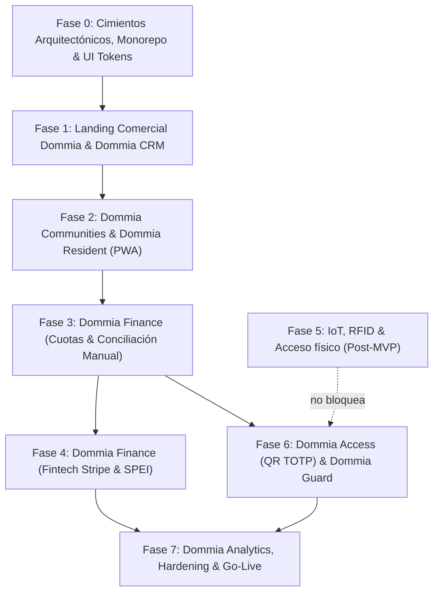

# 🚀 Plan de Desarrollo Maestro por Fases (Documento Vivo)
**Proyecto:** SaaS Modular para Fraccionamientos (DOMMIA)  
**Marca Principal:** DOMMIA  
**Producto Principal:** Dommia Communities  
**Tagline:** *El Sistema Operativo de tu Comunidad*  
**Versión:** 1.20.0

**Última Actualización:** 2026-09-29

**Estado:** Activo / En Evolución Continua

---

## 📌 Control de Versiones y Bitácora de Cambios
| Versión | Fecha | Autor / Agente | Descripción del Cambio |
| :--- | :---: | :--- | :--- |
| **1.0.0** | 2026-09-24 | Arquitectura & Pair Programmer | Creación del baseline integrando los 4 documentos iniciales de `/Docs` (Arquitectura C4, Anexo A, Recomendaciones y Plan Maestro v3). |
| **1.1.0** | 2026-09-24 | Arquitectura & Brand Alignment | Integración formal del Manual de Marca (`Saas Modular Frac Marca.md`), ecosistema de 8 productos (`Dommia Communities`, `Dommia CRM`, `Dommia Resident`, `Dommia Guard`, `Dommia Access`, `Dommia Finance`, `Dommia IoT`, `Dommia Analytics`), Design Tokens universales (Midnight Blue, Royal Blue, Inter, Manrope) y lineamientos de comunicación para el sitio web principal. |
| **1.2.0** | 2026-09-24 | Arquitectura & Pair Programmer | Expansión y formalización de **Dommia Guard**: Especificación como PWA Offline-First táctica para caseta de vigilancia, validación de QR con notificación al anfitrión, semáforo y auditoría de morosos, clasificador visual de placas de vehículos (LPR asistido) y canal de incidencias urgentes. |
| **1.3.0** | 2026-09-27 | Arquitectura & Pair Programmer | Cierre de PRE-F4: onboarding Resident seguro, aislamiento multi-tenant, login por correo/celular, recuperación, rate limiting, auditoría y revocación de sesiones. Configuración y entrega SMTP/WhatsApp bajo entitlement `NOTIFICATIONS_PREMIUM`. |
| **1.4.0** | 2026-09-27 | Arquitectura & Pair Programmer | Fase 5 pospuesta post-MVP. Fase 6 priorizada como control digital de accesos QR y consola Dommia Guard sin dependencia de plumas, RFID, Gateway, MQTT ni apertura física automática. |
| **1.5.0** | 2026-09-27 | Arquitectura & Pair Programmer | Inicio de Fase 6: emisión y validación API de QR TOTP para residentes y visitas, prevención de replay, pases persistidos y vista pública de invitación. Fase 6 queda desacoplada de Stripe y hardware; Dommia Guard scanner sigue pendiente. |
| **1.6.0** | 2026-09-27 | Arquitectura & Pair Programmer | Dommia Guard PWA implementada en puerto 3004 con login tenant-scoped GUARD, escaneo QR por cámara/entrada manual y autorización en línea. Communities permite aprovisionar y consultar cuentas de vigilancia para tenants con `ACCESS_QR`. |
| **1.7.0** | 2026-09-27 | Arquitectura & Pair Programmer | Aviso opcional al anfitrión después de validar visitas: WhatsApp Business con fallback SMTP, estado de entrega visible para Guard y sin modificar la autorización si no hay canal o falla el proveedor. |
| **1.8.0** | 2026-09-27 | Arquitectura & Pair Programmer | Excepción manual por morosidad con ticket HMAC de cinco minutos ligado al tenant y guardia, motivo obligatorio, consumo único y auditoría. QR inválido, vencido o revocado no admite override; la aprobación independiente de un supervisor sigue pendiente de decisión. |
| **1.9.0** | 2026-09-27 | Arquitectura & Pair Programmer | Inicio de implementación P1 en Dommia Guard: consulta tenant-scoped de residentes y placas; registro auditado de paquetería con estados pendiente/entregado y confirmación de retiro. Incidencias e historial operativo siguen pendientes. |
| **1.10.0** | 2026-09-28 | Arquitectura & Pair Programmer | Aclara alcance MVP: pagos manuales por SPEI o efectivo; Stripe es opcional, requiere entitlement contratado y no bloquea el MVP. Fase 5 queda detenida hasta evaluar la compatibilidad con el hardware de acceso existente en cada caseta. |
| **1.11.0** | 2026-09-28 | Arquitectura & Pair Programmer | Guard incorpora búsqueda por unidad/domicilio, clasificación por rol y listas de bloqueo/visita frecuente, reporte/triage administrativo de incidencias e historial filtrable. Build y smoke tests locales pasan; cámaras físicas y notificaciones premium reales siguen pendientes. |
| **1.12.0** | 2026-09-28 | Arquitectura & Pair Programmer | Agrega tres pruebas E2E ejecutables desde `pnpm test` para autorización/aislamiento, búsqueda/pases/clasificación e incidencias/historial. 3/3 pasan en QA local; staging, captura cronometrada y pruebas con dispositivos reales siguen pendientes. |
| **1.13.0** | 2026-09-28 | Arquitectura & Pair Programmer | MFA TOTP opcional para cuentas administrativas y CRM: enrolamiento con reautenticación, QR/clave manual, desafío posterior a contraseña, protección anti-replay, rate limit y rutas CRM autenticadas; E2E local 4/4. |
| **1.14.0** | 2026-09-28 | Arquitectura & Pair Programmer | Documenta el pool PostgreSQL compartido, `set_config` parametrizado, limpieza de `search_path`, transacciones y DDL por migración/provisión. Actualiza instrucciones E2E a migraciones 013–015, auth Bearer y resultado 4/4; agrega política de pruebas no destructivas. |
| **1.15.0** | 2026-09-28 | Arquitectura & Pair Programmer | El helper E2E espera hasta 15 s por readiness del API (configurable con `DOMMIA_TEST_STARTUP_TIMEOUT_MS`) antes de aplicar migraciones y seed; reduce fallos por arranque lento y conserva fallo explícito si el API no responde. Suite local 4/4. |
| **1.16.0** | 2026-09-28 | Arquitectura & Pair Programmer | Inicia LPR asistido en Guard: foto local, OCR Tesseract en navegador, sugerencia editable y consulta manual del clasificador existente. Clasificación por rol con badges diferenciados y texto accesible. Fixtures sintéticas: QAA-1001 al 90% y `TRT-827-A` al 47% con fondo/ángulo; root tests 6/6 (API 4 + Guard 2); faltan pruebas con placas/cámaras reales. |
| **1.17.0** | 2026-09-28 | Arquitectura & Pair Programmer | `Compartir QR` ahora exporta una tarjeta PNG vertical con identidad DOMMIA ACCESS, invitado, tipo, vigencia, destino, anfitrión y QR estable al pase; Android/iOS usan Web Share de archivos y escritorio descarga el PNG. Build Resident pasa; hoja nativa física pendiente. |
| **1.18.0** | 2026-09-28 | Arquitectura & Pair Programmer | Guard permite cancelar el arranque/detener cámara y recupera el control si no inicia en 12 s o no detecta QR en 30 s; validación API se aborta a los 10 s sin conceder acceso. Build Guard pasa; cámara física pendiente. |
| **1.19.0** | 2026-09-28 | Arquitectura & Pair Programmer | Sustituye entrada manual de payload QR por búsqueda de visita programada, verificación visual de INE y confirmación por llamada; registra `MANUAL_GUARD`, consume pases SINGLE y no almacena datos de INE. E2E API 5/5; falta prueba operacional en caseta. |
| **1.20.0** | 2026-09-29 | Arquitectura & Pair Programmer | Módulo táctico de Servicios/Proveedores (Comida, Gas, Agua, Paquetería, Taxi, Mantenimiento) con destinos específicos/generales y alertas a residentes/administrador; Bitácora unificada de eventos con filtros temporales; Búsqueda predictiva de calles con destinatario libre en paquetería y ciclo completo de notificación/cierre automático de alerta en Resident PWA al registrar retiro; `CustomSelect` temático uniforme en todas las PWAs. Suite API 8/8. |

---

## 🧭 Visión Global del Sistema: Ecosistema DOMMIA

**DOMMIA** (inspirado en *Domus* = Hogar) es la plataforma tecnológica que conecta administración, finanzas, seguridad, comunicación e infraestructura inteligente para comunidades residenciales modernas.

```
┌──────────────────────────────────────────────────────────────────────────────────────────────────┐
│                                     ECOSISTEMA DOMMIA                                            │
│                             "El Sistema Operativo de tu Comunidad"                               │
├────────────────────────────────┬─────────────────────────────────┬───────────────────────────────┤
│   1. DOMMIA CRM                │   2. DOMMIA COMMUNITIES         │   3. DOMMIA IOT & EDGE        │
│   (Backoffice del Operador)    │      (Portal Fraccionamiento)   │      (Infraestructura Caseta) │
├────────────────────────────────┼─────────────────────────────────┼───────────────────────────────┤
│ • Prospectos & Pipeline Ventas │ • Padrón de Residentes          │ • Dommia IoT Gateway (Edge)   │
│ • Suscripciones & Límites Plan │ • Catálogo de Propiedades       │ • Dommia Access (RFID/Wiegand)│
│ • Facturación Global SaaS      │ • Dommia Finance (Cuotas/Stripe)│ • Relevador Pluma (Contacto)  │
│ • Health Gateways (Telemetría) │ • Dommia Resident (PWA Offline) │ • SQLite Local Offline-First  │
│ • Aprovisionamiento de Tenants │ • Dommia Guard (Caseta Web)     │ • Sincronización Batch MQTT   │
│ • Inventario de Hardware       │ • Circulares & Avisos           │ • Buffer Circular Antifallos  │
└────────────────────────────────┴─────────────────────────────────┴───────────────────────────────┘
                                                 │
                                                 ▼
        ┌────────────────────────────────────────────────────────────────────────┐
        │                    NÚCLEO TECNOLÓGICO CLOUD & EDGE                     │
        ├────────────────────────────────────────────────────────────────────────┤
        │ • Backend: NestJS (Monolito Modular con Dominios Desacoplados)         │
        │ • Base de Datos Central: PostgreSQL 16 (Schemas Independientes)        │
        │ • Frontend Web & PWA: Next.js + React + Tailwind + Dexie.js (IndexedDB)│
        │ • Design System Centralizado: @dommia/ui (Midnight Blue & Royal Blue)   │
        │ • Comunicación IoT: MQTT Broker (EMQX con TLS y Certificados)          │
        │ • Almacenamiento Edge: SQLite en Gateway para validación física local  │
        │ • Cache/Escala: Redis (Pospuesto formalmente para etapa post-MVP)      │
        └────────────────────────────────────────────────────────────────────────┘
```

### Arquitectura de Productos Dommia
1. **Dommia Communities:** Portal operativo web principal para el Administrador del Fraccionamiento.
2. **Dommia CRM:** Backoffice comercial y de soporte exclusivo del operador del negocio SaaS.
3. **Dommia Resident:** Aplicación web progresiva (PWA Offline-First) para colonos y residentes.
4. **Dommia Guard:** Aplicación web progresiva (PWA Offline-First) táctica y de alto contraste para tablet s y computadoras de caseta de vigilancia.
5. **Dommia Access:** Motor de validación de accesos vehiculares y peatonales (RFID UHF + QR Dinámico TOTP).
6. **Dommia Finance:** Motor contable de cuotas, recargos, conciliación bancaria y pasarela fintech Stripe.
7. **Dommia IoT:** Firmware y servicios distribuidos para Gateways en caseta con tolerancia a fallos.
8. **Dommia Analytics:** Tableros de control ejecutivos, financieros, operativos y de soporte.

---

## 🎨 Design System y Directrices de Marca DOMMIA

Todas las aplicaciones del ecosistema deberán consumir tokens centralizados de diseño definidos en `@dommia/ui`:

### Paleta de Colores
* **Corporativos:**
  * **Midnight Blue (Primario):** `#0F172A` (Bases, navegación, fondos oscuros, textos de alta jerarquía)
  * **Royal Blue (Secundario / Acento):** `#2563EB` (Botones primarios, enlaces, llamadas a la acción, acentos activos)
  * **Blanco:** `#FFFFFF` (Superficies de tarjetas, fondos limpios)
  * **Gris Base:** `#F8FAFC` (Fondos neutros de dashboards, paneles secundarios)
* **Funcionales:**
  * **Éxito (Acceso Permitido / Pago Conciliado):** `#10B981` (Emerald)
  * **Advertencia (Por Vencer / Gateway Inestable):** `#F59E0B` (Amber)
  * **Error (Acceso Denegado / Moroso / Falla Crítica):** `#DC2626` (Red)

### Tipografía Oficial
* **Principal (UI, lectura, datos, tablas, formularios):** `Inter`
* **Secundaria (Títulos, Headings, números de dashboard, Display):** `Manrope`

### Concepto de Isotipo / Logotipo
* Construcción geométrica basada en: **D + Hogar + Nodo Digital** (vivienda moderna conectada en red).

---

## 🛡️ Principios Arquitectónicos Inquebrantables
1. **PostgreSQL es la Única Fuente de Verdad:** Ninguna base de datos periférica (IndexedDB en navegador o SQLite en caseta) dictamina estados contables o de acceso definitivos.
2. **Multi-Tenancy por Schemas:** El aislamiento entre fraccionamientos se realiza mediante Schemas independientes de PostgreSQL (`tenant_<slug>`), mientras que el esquema `public` almacena catálogos maestros y datos globales del SaaS.
3. **Offline-First sin Redis en MVP (ADR-001):** La tolerancia a fallos de internet recae en **SQLite** (en caseta) e **IndexedDB + Service Workers** (en la PWA). Redis queda reservado para la etapa de escalamiento masivo (>50 fraccionamientos o >1000 usuarios concurrentes).
4. **Idempotencia Universal:** Todo registro generado en modo desconectado o webhook transaccional de Stripe viaja con un `UUID` inmutable para prevenir duplicados.
5. **Límites Duros por Nivel de Suscripción:** El sistema bloquea a nivel de API (`403 Forbidden`) cualquier intento de crear propiedades o habilitar módulos que excedan el paquete contratado.
6. **Consistencia de Marca & Experiencia Unificada:** Todo módulo del sistema debe reflejar simplicidad, seguridad, rapidez y modernidad visual sin tecnicismos innecesarios para el usuario final.

---

## 🗺️ Mapa de Fases de Desarrollo



---

## 📋 Detalle de Fases de Implementación

---

### 🧱 FASE 0: Cimientos Arquitectónicos, Monorepo y UI Tokens
**Objetivo:** Establecer la infraestructura del código, el motor multi-inquilino de PostgreSQL, la seguridad transversal y los tokens de diseño de la marca DOMMIA.

* **Estado:** `[x] Completada (2026-09-24)`
* **Dependencias:** Ninguna

#### Tareas Técnicas:
- [x] **Estructura del Monorepo (Turborepo + pnpm workspaces):**
  - `apps/api`: Backend principal NestJS (Monolito Modular con PostgreSQL dinámico).
  - `apps/crm-admin`: Frontend web Next.js 15 para **Dommia CRM** (puerto 3001).
  - `apps/portal-web`: Estructura base para **Dommia Communities** y **Dommia Resident**.
  - `packages/shared-types`: Interfaces DTO, enums y contratos de API compartidos (`@dommia/shared-types`).
  - `packages/ui`: Componentes y Design Tokens de la marca DOMMIA (`@dommia/ui`).
  - `packages/config-tailwind`: Preset compartido de Tailwind CSS con tokens oficiales.
  - `packages/config-typescript`: Configuraciones base de TypeScript.
- [x] **Design System & UI Tokens (`packages/ui`):**
  - Paleta oficial: Midnight Blue (`#0F172A`), Royal Blue (`#2563EB`), Blanco (`#FFFFFF`), Gris Base (`#F8FAFC`).
  - Variables de colores funcionales: Éxito (`#10B981`), Advertencia (`#F59E0B`), Error (`#DC2626`).
  - Configuración tipográfica de `Inter` y `Manrope`.
  - Componentes base creados: `Logo` (D + Hogar + Nodo Digital), `Button`, `Badge`, `Card`.
- [x] **Infraestructura Local Docker (`docker-compose.yml`):**
  - PostgreSQL 16 con extensiones uuid-ossp y pgcrypto en puerto 5432.
  - EMQX 5.8 (Broker MQTT para IoT con puertos 1883, 8883, 8083, 8084 y 18083 para Dashboard).
- [x] **Esquema Global PostgreSQL (`public`):**
  - Tablas operativas: `tenants`, `subscriptions`, `crm_prospects`, `gateway_inventory`, `audit_logs`.
- [x] **Módulo Dynamic Multi-Tenant en NestJS:**
  - `DatabaseService` con pool `pg` compartido (`max: 20`), `set_config('search_path', $1, false)` parametrizado, limpieza del estado por cliente y cierre del pool en shutdown. Ver [Conexión PostgreSQL y Multi-Tenancy](../Arquitectura/Conexion%20PostgreSQL%20y%20Multi-Tenancy.md).
  - Función almacenada `provision_tenant_schema` que crea automáticamente el esquema del tenant y sus 8 tablas hijas (`properties`, `residents`, `vehicles`, `rfid_tags`, `invitations`, `access_logs`, `financial_charges`, `financial_payments`).
  - Endpoints probados y verificados: `GET /api/v1/tenants`, `POST /api/v1/tenants`, `GET /api/v1/tenants/:slug/properties`, `POST /api/v1/tenants/:slug/properties`.
- [x] **Módulo de Seguridad y RBAC Transversal:**
  - Definición de los 7 roles en `@dommia/shared-types`: `SUPER_ADMIN`, `COMMERCIAL_EXEC`, `SUPPORT`, `TENANT_ADMIN`, `OPERATOR`, `GUARD`, `RESIDENT`.
- [x] **Criterios de Aceptación Verificados:**
  - `docker compose up -d` levanta y mantiene saludables PostgreSQL y EMQX.
  - Se probó el aprovisionamiento dinámico de `tenant_valle_real` en menos de 100 milisegundos con aislamiento total respecto a `tenant_demo`.
  - `@dommia/ui` exporta componentes y tokens corporativos consumidos con éxito por `apps/crm-admin`.

---

### 🏢 FASE 1: Landing Comercial Dommia & Dommia CRM (Backoffice)
**Objetivo:** Construir la presencia comercial pública de DOMMIA con su identidad corporativa y el panel de control del operador para gestionar prospectos, altas de fraccionamientos y monitoreo de hardware.

* **Estado:** `[x] Completada (2026-09-24)`
* **Dependencias:** Fase 0

#### Tareas Técnicas:
- [x] **Landing Page Pública Oficial (Next.js SSR/SSG en `apps/portal-web` - Puerto 3000):**
  - Aplicación de identidad visual DOMMIA: Isotipo oficial (D + Hogar + Nodo Digital), paleta Midnight Blue (`#0F172A`) y Royal Blue (`#2563EB`).
  - Tagline principal: *"El Sistema Operativo de tu Comunidad"*.
  - Mensaje de valor claro: Plataforma que conecta administración, finanzas, seguridad y tecnología.
  - Sección "Lo que SOMOS vs Lo que NO somos" y desglose del ecosistema de 8 productos.
  - Cotizador dinámico e interactivo por número de viviendas con cálculo y recomendación de Tiers en tiempo real (Básico, Estándar, Profesional, Enterprise).
  - **Formulario Dual de Adquisición:**
    1. **Solicitar Demostración (Venta Asistida / Enterprise):** Registra el prospecto como `LEAD` en el pipeline comercial de CRM (`POST /api/v1/crm/prospects`).
    2. **Contratar y Activar de Inmediato (Self-Service Zero-Touch):** Aprovisionamiento atómico e instantáneo (`POST /api/v1/crm/self-service-provision`) con creación del schema PostgreSQL, usuario administrador con hash bcrypt, suscripción y registro automático como deal `WON`.
  - **Blindaje y Protección de Propiedad Intelectual (Anti-Scraping / Anti-Clonado):**
    - Deshabilitación total de mapas de fuentes (`productionBrowserSourceMaps: false`) en todo el monorepo.
    - Supresión de firmas de servidor (`poweredByHeader: false`).
    - Cabeceras de seguridad estrictas (`X-Frame-Options: SAMEORIGIN/DENY`, `X-Content-Type-Options: nosniff`, `Referrer-Policy: strict-origin-when-cross-origin`).
    - Trampa Honeypot invisible (`website_anti_bot_trap`) que neutraliza bots y scrapers sin almacenar basura ni alertar al atacante.
    - Bloqueo y descarte de correos temporales/desechables (`mailinator`, `tempmail`, etc.) para proteger los entornos demo de reconocimiento anónimo.
    - Protocolo formal documentado en [Protocolo de Seguridad y Protección de Propiedad Intelectual](../Arquitectura/Protocolo%20de%20Seguridad%20y%20Proteccion%20de%20Propiedad%20Intelectual.md).
  - SEO técnico optimizado con Semantic HTML, Open Graph, Twitter Cards y Schema.org JSON-LD.
- [x] **Dommia CRM - Dashboard Ejecutivo (`apps/crm-admin` - Puerto 3001):**
  - Métricas clave en tiempo real: MRR ($15,960 MXN), ARR ($191,520 MXN), Churn rate (0.0%), Fraccionamientos activos (4), Casas totales administradas (505 viviendas).
  - Desglose financiero por Tiers contratados (Básico, Estándar, Profesional, Enterprise).
  - Botón de sincronización con contraste optimizado (`variant="dark-outline"`).
- [x] **Dommia CRM - Pipeline Comercial:**
  - Tablero Kanban interactivo con 5 etapas: `LEAD` -> `CONTACTED` -> `DEMO` -> `PROPOSAL` -> `WON`.
  - Avance y retroceso rápido de etapa con persistencia en base de datos (`PATCH /api/v1/crm/prospects/:id/stage`).
  - Botón directo en prospectos ganados para aprovisionar fraccionamiento pre-llenando sus datos.
- [x] **Dommia CRM - Aprovisionamiento de Fraccionamientos:**
  - Formulario de contratación: Razón social, subdominio (`{slug}.dommia.com`), límite de casas contratadas (límite duro), selección de módulos activos (Finanzas, QR Dinámico, RFID, Residentes PWA).
  - Creación automática del Schema en PostgreSQL (`provision_tenant_schema`) y aislamiento estricto verificado.
- [x] **Dommia CRM - Inventario y Telemetría IoT:**
  - Registro de Gateways con UUID único, firmware, notas y fraccionamiento vinculado (`POST /api/v1/crm/gateways`).
  - Detección dinámica de estado: 🟢 `ONLINE` si el último heartbeat fue hace &le; 90s, o 🔴 `ALERTA: OFFLINE` si excede los 90 segundos.
  - Endpoint de simulación de Heartbeat MQTT (`POST /api/v1/crm/gateways/:uuid/heartbeat`).

- [x] **Dommia CRM - Gestión Dinámica de Planes SaaS y Monetización:**
  - Nueva entidad y tabla `public.saas_plans` en PostgreSQL con catálogo de tiers (`BASIC`, `STANDARD`, `PROFESSIONAL`, `ENTERPRISE`), precios mensuales, topes de viviendas, módulos base y add-ons disponibles.
  - Tab 5 en CRM Maestro: **"Planes & Módulos"** (`apps/crm-admin`) para visualizar los 4 tiers y modal de edición en vivo sin alterar código ni reiniciar servicios.
  - Recálculo dinámico de MRR y ARR en el backend (`apps/api`) consultando directamente `public.saas_plans` y sumando ingresos recurrentes por add-ons contratados.
- [x] **Política de Dominios Adaptada al Modelo de Negocio:**
  - **Dominio Estándar Compartido:** `standar.dommia.com/{slug}` asignado por defecto en planes Básico, Estándar y Profesional sin costo extra.
  - **Add-on de Subdominio Personalizado:** Opción contratada (+ $490 MXN/mes) para habilitar `{slug}.dommia.com` en planes menores.
  - **Inclusión 100% Gratuita en Enterprise:** Subdominio propio `{slug}.dommia.com` bonificado automáticamente en el paquete Enterprise.
  - Reflejo del modelo en el Cotizador, Formulario de Auto-Activación y visualización diferenciada de etiquetas en el listado de fraccionamientos de CRM Maestro.

#### Criterios de Aceptación Verificados:
- Un prospecto que solicita demo se registra en el pipeline comercial de Dommia CRM en tiempo real bajo esquema blindado sin entrega de archivos ni credenciales desprotegidas.
- La contratación directa aprovisiona el condominio en menos de 100ms, generando credenciales encriptadas y cerrando la venta como `WON`.
- La activación de un fraccionamiento crea su esquema en base de datos (`tenant_<slug>`), asigna la URL de acceso correspondiente (`standar.dommia.com/{slug}` o subdominio personalizado) y aísla los datos por completo.
- Los precios, topes de viviendas y costos de add-ons de los planes SaaS son editables desde CRM Maestro y recalculan las finanzas (MRR/ARR) automáticamente.
- Si un Gateway pierde conexión por más de 90 segundos, Dommia CRM cambia dinámicamente su estado a `OFFLINE` y emite una alerta operativa.

---

### 🏘️ FASE 2: Dommia Communities (Portal Operativo) & Dommia Resident (PWA)
**Objetivo:** Desarrollar el portal de administración del fraccionamiento y la aplicación web progresiva para los residentes.

* **Estado:** `[x] Completada`
* **Dependencias:** Fase 0, Fase 1

- [x] **Catálogo de Propiedades con Bloqueo de Límite Duro:**
  - Creación de la aplicación dedicada **Dommia Communities** (`apps/communities-admin` - Puerto 3002).
  - Autenticación con `pgcrypto` para administradores de fraccionamiento (`POST /api/v1/auth/login`).
  - Registro de calles, manzanas, lotes y números de vivienda en el schema dedicado (`tenant_<slug>.properties`).
  - **Enforcement estricto en backend:** Si `total_propiedades >= limite_casas_permitidas`, rechazo automático con `409/403 LIMIT_EXCEEDED`.
  - **Frontend reactivo:** Barra de progreso de capacidad de licencias, indicador de ocupación en tiempo real y **Modal de Solicitud de Upgrade de Plan** con enlace directo a Dommia CRM cuando se alcanza el tope contratado.
  - Edición y eliminación de propiedades con liberación instantánea de espacios en la cuota permitida.
- [x] **Padrón de Residentes e Inquilinos & Registro Vehicular:**
  - **Estructura Multi-Tenant:** Tablas aisladas `residents` y `vehicles` en cada esquema `tenant_<slug>`.
  - **Clasificación de Residentes:** `OWNER` (Propietario residente), `TENANT` (Arrendatario / Inquilino), `FAMILY_MEMBER` (Familiar / Dependiente).
  - **Gestión de Titularidad:** Identificación de contacto titular principal (`is_primary`) para encabezados y recepción de notificaciones clave.
  - **Registro Vehicular:** Control de placas vehiculares, marca, modelo, color, vinculación obligatoria a vivienda y opcional a residente conductor.
  - **Backend API (`apps/api`):** Endpoints completos de listado, alta, edición y baja:
    - `/api/v1/tenants/:slug/residents` (con filtros y resolución de vivienda).
    - `/api/v1/tenants/:slug/vehicles` (con filtros y resolución de vivienda y habitante).
  - **Frontend Dommia Communities (`apps/communities-admin` - Puerto 3002):**
    - Pestaña **"Padrón de Residentes"** con tarjetas métricas, búsqueda en vivo, filtros por rol y modal de alta/edición con enlaces directos a WhatsApp y llamada telefónica.
    - Pestaña **"Control Vehicular"** con badges de placas estilo vehicular mexicano, marca, modelo y conductor asociado.
    - Interconexión contextual desde la pestaña **"Viviendas & Lotes"** con badges de conteo y accesos directos para registrar habitantes o autos a una casa en 1 clic.
- [x] **Adopción del Estándar de Arquitectura Frontend en 3 Capas (Completado en `communities-admin` y `crm-admin`):**
  - **Capa 1: Presentación (TSX):** Componentes visuales "tontos" sin llamadas a API directas, alimentados 100% por props tipadas (`apps/*/src/features/*/components/`).
  - **Capa 2: Lógica (Custom Hooks):** Lógica de estado (`useState`, `useEffect`, `useMemo`), validaciones, sincronización con API y manejadores de eventos desacoplados en hooks independientes (`apps/*/src/features/*/hooks/`).
  - **Capa 3: Estilos & Tokens:** Tokens consistentes mediante Tailwind CSS y `@dommia/ui` organizados para no saturar los flujos de renderizado.
  - **Orquestadores Raíz Delgados:**
    - `apps/communities-admin/src/app/page.tsx` reducido de ~2,900 líneas a menos de 280 líneas limpias y declarativas.
    - `apps/crm-admin/src/app/page.tsx` reducido de ~1,960 líneas a tan solo 137 líneas declarativas y desacopladas.
  - **Documento Rector:** [Estandar de Arquitectura Frontend - 3 Capas.md](../Arquitectura/Estandar%20de%20Arquitectura%20Frontend%20-%203%20Capas.md) incorporado en la suite de arquitectura oficial.
- [x] **Adopción del Estándar de Arquitectura Backend en 3 Capas por Dominio:**
  - **Capa 1: Transporte & Controladores (Controllers & DTOs):** Manejo exclusivo de rutas HTTP REST, validación estricta con `class-validator`, códigos de respuesta (`200`, `201`, `400`, `404`). Cero SQL, cero lógica de negocio.
  - **Capa 2: Lógica de Dominio (Services):** Reglas de negocio puras (enforcement de límite duro de casas, validación de correos duplicados, normalización de placas, cálculo financiero MRR/ARR, anti-bot).
  - **Capa 3: Acceso a Datos & Persistencia (Repositories):** Aislamiento de consultas SQL parametrizadas a PostgreSQL y manejo del `search_path` dinámico multi-tenant (`tenant_<slug>`).
  - **Modularización por Dominio:** Descomposición del "God Service" `tenants.service.ts` (>530 líneas) en módulos independientes: `tenants`, `properties`, `residents`, `vehicles`, `auth`, `crm`, `health`.
  - **Documento Rector:** [Estandar de Arquitectura Backend - 3 Capas.md](../Arquitectura/Estandar%20de%20Arquitectura%20Backend%20-%203%20Capas.md) incorporado en la suite de arquitectura oficial.
- [x] **Dommia Resident (PWA Offline-First como Aplicación Independiente en Monorepo - `apps/resident-pwa` - Puerto 3003):**
  - **Decisión Arquitectónica:** Creada como aplicación independiente en el monorepo en lugar de una sub-ruta embebida dentro de `communities-admin`. Esto garantiza:
    1. Scope aislado de Service Worker (`/`) sin interferencia de caché con el portal administrativo.
    2. Bundle ultraligero para redes móviles lentas (< 150 KB gzipped) sin librerías pesadas de escritorio ni gráficos.
    3. Seguridad y aislamiento de cookies/tokens de sesión entre el residente y el administrador.
    4. Cero fallas por caídas de internet en la entrada vehicular gracias a la filosofía 100% *Offline-First*.
  - **PWA Shell & Service Worker (`public/manifest.json`, `public/sw.js`):**
    - Manifest configurado con `display: standalone`, tema Midnight Blue (`#0B1120`), acento Emerald (`#10B981`) e iconos corporativos vectoriales SVG (192x192 y 512x512).
    - Service Worker nativo con estrategia dual: *Stale-While-Revalidate* para assets estáticos y *Cache-First* para fuentes y shell de la aplicación.
  - **Motor IndexedDB Tipado Sin Dependencias Externas (`src/lib/db.ts`):**
    - Implementación nativa sobre la API estándar de IndexedDB con esquema Dexie-compatible.
    - 4 almacenes de objetos dedicados: `profile`, `invitations`, `notices` y `syncQueue`.
  - **Generador de QR Dinámico TOTP Local (`src/lib/totp.ts`):**
    - Algoritmo de rotación de credenciales criptográficas cada 30 segundos totalmente ejecutado en el dispositivo del colono, compatible con lectores ópticos de caseta aun en modo avión o sin señal 4G/5G.
    - Simulación de apertura física de pluma/portón con feedback háptico y visual.
  - **Módulo de Pases e Invitaciones de Visita (`features/invitations/`):**
    - Generación offline de pases para visitas (un solo uso, recurrentes o servicios).
    - **Motor Gráfico de Tarjetas de Pase QR (`src/lib/passCardGenerator.ts`):** Renderizado en canvas HTML5 de alta resolución (640x960 px) que genera una tarjeta institucional con logo DOMMIA ACCESS, nombre del fraccionamiento, nombre del invitado, tipo de pase, código QR de alto contraste, fecha de vigencia y domicilio del anfitrión.
    - **Modal de Compartición Multicanal (`SharePassModal.tsx`):**
      1. *Compartir Imagen en WhatsApp / Sistema:* Web Share API Level 2 con adjunto directo de archivo binario `image/png`.
      2. *Copiar Imagen al Portapapeles:* Uso de `navigator.clipboard.write([ClipboardItem])` para pegar directamente la imagen con `Ctrl + V` en WhatsApp Web o Telegram Desktop.
      3. *Descargar PNG:* Guardado inmediato en la galería o descargas del dispositivo.
      4. *Texto WhatsApp:* Fallback de mensaje textual con enlace pre-formateado.
    - Cola de sincronización en segundo plano con backoff exponencial y jitter aleatorio (500ms - 2500ms) para mitigar el efecto *Thundering Herd* al reconectarse.
  - **Adopción Estricta de Arquitectura Frontend en 3 Capas:**
    - Capa de Presentación: `MobileTopBar`, `MobileTabBar`, `ResidentCard`, `DynamicQRModal`, `AccessGateButton`, `ActivePassesList`, `QuickInviteModal`, `NoticesFeed`, `ResidentFinanceCard`.
    - Capa de Lógica: Hooks desacoplados `useOnlineStatus`, `useDynamicQR`, `useInvitations`, `useNotices`.
    - Capa de Estilos: Tokens Tailwind corporativos (Midnight Blue, Emerald, Royal Blue).
    - Orquestador raíz `page.tsx` de solo 177 líneas y ningún componente supera las 202 líneas (cumplimiento total de la regla < 250 líneas).
- [x] **Módulo de Comunicación y Avisos (Completado en Backend, Admin y PWA):**
  - **Backend (`apps/api/src/modules/notices/`):**
    - Tabla `notices` aprovisionada por esquema de tenant (`tenant_<slug>.notices`) con soporte para título, cuerpo, categoría (`URGENT`, `MAINTENANCE`, `ASSEMBLY`, `GENERAL`), prioridad (`HIGH`, `MEDIUM`, `LOW`), firma del emisor, flags `is_pinned` e `is_published`.
    - Endpoints REST en 3 capas (`GET`, `POST`, `PUT`, `DELETE` en `/api/v1/tenants/:slug/notices`) con DTOs validados mediante `class-validator`.
  - **Frontend Administrativo (`apps/communities-admin`):**
    - Pestaña interactiva **"Comunicados & Circulares"** con conteo en vivo, barra de búsqueda en tiempo real y filtrado por categoría.
    - Modal de alta y edición con selector de prioridad, fijado superior (`is_pinned`) y confirmación de publicación.
  - **Frontend Residente (`apps/resident-pwa`):**
    - Feed móvil reactivo en pestaña dedicada con badges visuales clasificados por color según urgencia o tipo de circular.
    - Sincronización en línea bidireccional con fallback automático y persistencia en IndexedDB (`db.notices`) para lectura instantánea sin conexión.

#### Criterios de Aceptación de Onboarding:
- El administrador no puede registrar la casa `N+1` si el tier contratado es para `N` viviendas.
- Dommia Resident se instala correctamente en dispositivos móviles (iOS y Android) y abre de inmediato aun sin señal celular.

---

### 💵 FASE 3: Dommia Finance (Cuotas & Conciliación Manual)
**Objetivo:** Proveer a los administradores del fraccionamiento el control total de las finanzas comunitarias antes de integrar pasarelas automatizadas.

* **Estado:** `🟢 Completada`
* **Dependencias:** Fase 2

#### Tareas Técnicas:
- [x] **Configuración de Estructura de Cuotas (Completado en Backend & Admin):**
  - **Base de Datos & Esquema Tenant:** Tabla `fee_configurations` aprovisionada con soporte para cuotas ordinarias fijas (`FIXED_RECURRENT`), cuotas variables por metraje de lote m² (`VARIABLE_LOT_SIZE`) y cuotas extraordinarias (`EXTRAORDINARY`), reglas de recargos por mora (% o fijo), días de gracia y descuentos por pronto pago.
  - **Backend NestJS (`apps/api/src/modules/finance/`):** Módulo `FinanceModule` en 3 capas (`FeeConfigurationController`, `FeeConfigurationService`, `FeeConfigurationRepository`) con CRUD completo, validación con `class-validator` y endpoint de simulación de cobro lote por lote (`POST /api/v1/tenants/:slug/finance/fees/:id/simulate`).
  - **Frontend Administrativo (`apps/communities-admin`):** Pestaña "Finanzas & Cuotas" con KPI cards de resumen, buscador predictivo, filtrado por tipo, modal de creación/edición, switches reactivos de activación y modal de simulación de recaudación proyectada.
- [x] **Motor de Cobranza Mensual:**
  - Tarea programada (Cron Job) que corre el día 1 de cada mes (y ejecutable bajo demanda por el administrador) que genera los cargos por propiedad en el schema del tenant según las cuotas activas (`FIXED_RECURRENT`, `VARIABLE_LOT_SIZE`, `EXTRAORDINARY`).
  - Idempotencia garantizada mediante índice único por propiedad, cuota y periodo, además de `ON CONFLICT DO NOTHING`.
- [x] **Registro Administrativo de Pagos en Ventanilla (Efectivo) y SPEI Manual (MVP):**
  - **Pago en Efectivo en Administración:** Flujo presencial donde el Residente acude a las oficinas del fraccionamiento. El administrador recibe el dinero, selecciona la vivienda, elige las cuotas ordinarias o extraordinarias a liquidar, registra el pago como `"CASH"` (Efectivo), captura folio/notas opcionales y acredita el pago.
  - **Acreditación Inmediata de Saldo:** Actualización automática del estatus de la vivienda a *Al Corriente* (`is_delinquent = false`) al no tener adeudos vencidos.
  - **Notificación y Alerta al Residente:** Disparo de notificación/alerta en la PWA de Dommia Resident confirmando *"Tu pago de $X ha sido recibido y acreditado por la administración"*, actualizando su historial y recibo digital.
  - **Comprobantes y Transferencias SPEI:** La PWA permite enviar comprobantes PDF o imagen de hasta 4 MB. Communities muestra alertas de pendientes, permite consultar el comprobante y aprobar/rechazar. Solo la aprobación acredita el saldo.
- [x] **Campañas de Pago Anual con Descuento:**
  - Campañas independientes de la cobranza mensual con periodo, meses cubiertos y porcentaje de descuento.
  - Cotización por vivienda con monto bruto, descuento y total neto.
  - Envío de comprobante SPEI o registro de pago en efectivo con validación administrativa.
  - Identificación de residentes comprometidos, pendientes, aprobados y rechazados.
  - Bolsa aprobada de prepago y descuento otorgado por campaña, sin alterar los cargos mensuales.
  - **Preparación de Arquitectura para Pasarelas (Post-MVP Stripe):** Esquema de base de datos desacoplado con campos preparados (`payment_method`, `gateway_provider`, `gateway_tx_id`, `gateway_status`) para integrar Stripe Connect en la Fase 4 sin migraciones destructivas.
- [x] **Estados de Cuenta y Saldos en Tiempo Real:**
  - Cálculo de saldo consolidado, desglose de adeudos por concepto y saldo a favor por vivienda.
  - Emisión de recibos digitales con folio interno.
  - Clasificación de estado de cuenta: Al corriente vs Moroso (bandera consumida por Dommia Access / Casetas).

### 🔐 UNIDAD PRE-F4: Onboarding y Acceso Seguro de Residentes
**Objetivo:** Permitir que cada residente tenga una cuenta propia en Dommia Resident antes de utilizar pagos, estados de cuenta, invitaciones y accesos digitales.

* **Estado:** `[x] Completada (2026-09-27)`
* **Dependencias:** Fase 2, módulo de autenticación y padrón de residentes.

#### Tareas Técnicas:
- [x] **Invitación por enlace de activación:**
  - El administrador selecciona un residente registrado y genera un enlace de un solo uso, por correo o WhatsApp cuando `NOTIFICATIONS_PREMIUM` está contratado.
  - El backend almacena únicamente el hash del token, con expiración de 24 horas.
  - El enlace permite definir la contraseña inicial y queda invalidado después de utilizarse.
  - Reenvío y revocación de invitaciones con auditoría.
- [x] **Alta administrativa con contraseña temporal:**
  - El administrador puede crear o activar la cuenta del residente.
  - El sistema genera una contraseña temporal aleatoria que no se almacena en texto plano.
  - La primera sesión obliga a cambiar la contraseña mediante `must_change_password`.
- [x] **Autenticación propia de Dommia Resident:**
  - Login separado del portal administrativo.
  - Sesión limitada al residente, vivienda y tenant autorizados.
  - La PWA deja de depender del perfil demo para consultar estados financieros o enviar comprobantes.
- [x] **Recuperación y seguridad de cuenta:**
  - Recuperación de contraseña mediante enlace temporal.
  - Revocación persistente de sesiones y tokens de activación.
  - Rate limiting para login, activación y recuperación.
  - Auditoría de invitaciones, cambios de contraseña y accesos.

#### Modelo Mínimo:
```text
users
  id, email, password_hash, role, tenant_id
  must_change_password, password_changed_at, is_active

resident_invitations
  id, resident_id, token_hash, expires_at
  used_at, revoked_at, created_by
```

#### Criterios de Aceptación de Fase 3:
- Un administrador puede enviar una invitación a un residente registrado.
- Un enlace expirado, usado o revocado no permite crear contraseña.
- Una contraseña temporal obliga al residente a cambiarla antes de acceder a la PWA.
- El residente solo puede consultar su vivienda y sus datos financieros.
- El residente puede iniciar sesión sin reutilizar la sesión de Communities.
- El flujo registra auditoría sin almacenar tokens ni contraseñas en texto plano.
- La unidad debe estar completada antes de habilitar pagos Stripe o iniciar la Fase 4.

#### Criterios de Aceptación:
- El primer día del mes se generan automáticamente los cobros a todas las propiedades activas.
- El administrador puede registrar pagos en efectivo en ventanilla y acreditarlos en 1 clic.
- La acreditación de un pago (efectivo o SPEI) actualiza instantáneamente el saldo de la vivienda, su estatus de morosidad y notifica al residente en su PWA.
- La estructura de datos permite incorporar Stripe Connect en Fase 4 sin reescribir la lógica contable.

---

### 💳 FASE 4: Stripe Connect Opcional (Post-MVP)
**Objetivo:** Habilitar cobros automatizados solo para tenants que contraten el módulo Stripe, sin desplazar ni bloquear el flujo manual de pagos del MVP.

**Regla de entitlement:** Stripe solo se muestra y procesa cuando el tenant tiene contratado `STRIPE`, `STRIPE_CONNECT` o `FINANCE_STRIPE` en `public.tenants.modules`. SPEI, efectivo y campañas anuales permanecen disponibles sin ese módulo.

**Alcance MVP:** Todos los pagos de mantenimiento se reciben por SPEI con comprobante y validación manual del administrador, o en efectivo registrado por el administrador. Stripe no es requisito de aceptación ni prioridad del MVP.

* **Estado:** `[~] Implementación parcial; opcional y fuera de prioridad MVP (2026-09-28)`
* **Dependencias:** Fase 3

> El código Stripe existente debe permanecer protegido por entitlement. No habilitarlo para clientes hasta completar pruebas sandbox end-to-end, recuperación segura ante fallos de webhooks y definición de liquidación/comisión.

#### Tareas Técnicas:
- [~] **Stripe Connect / Cuentas Conectadas:**
  - Entitlement estricto por módulos `STRIPE`, `STRIPE_CONNECT` o `FINANCE_STRIPE`.
  - Onboarding Express real preparado con persistencia de cuenta conectada y `Account Link`.
- [~] **Pasarela de Cobro en Dommia Resident:**
  - Checkout Stripe creado y visible únicamente para tenants con entitlement y cargos pendientes.
  - Retorno seguro con `session_id`, validación server-side de tenant y propiedad, y estados de cancelación/pendiente.
  - Falta sustituir redirección por Stripe Elements si se requiere checkout embebido.
  - Asignación de referencias bancarias automatizadas (SPEI vía Stripe).
- [~] **Webhooks Idempotentes de Stripe:**
  - Endpoint con verificación criptográfica de firma.
  - Idempotencia por `event_id` para evitar duplicidad de abonos.
  - Acreditación mediante el motor financiero existente; falta validación sandbox end-to-end.
- [ ] **Cobro de Comisión del SaaS:**
  - Deducción automatizada del porcentaje o tarifa fija por transacción pactada en la suscripción del fraccionamiento.

#### Criterios de Aceptación:
- Un pago simulado en Stripe sandbox actualiza el estado de cuenta de la propiedad a "PAGADO" inmediatamente vía webhook.
- Un webhook duplicado intencionalmente es detectado y descartado sin alterar los balances contables.

---

### 📡 FASE 5: Integración con Hardware de Caseta (Detenida / Post-MVP)
**Objetivo:** Evaluar e integrar Dommia Access con los equipos de acceso y plumas que ya operan en cada caseta, respetando sus protocolos, restricciones y mecanismos de seguridad.

* **Estado:** `[⏸] Detenida; no iniciar implementación hasta completar descubrimiento de hardware por sitio`
* **Dependencias:** Fase 0, Fase 2

> **Decisión de alcance:** Esta fase no bloquea el MVP ni la Fase 6. Antes de diseñar un Gateway o asumir Wiegand/MQTT, se debe inventariar por caseta la marca/modelo de pluma, controladora, lectores, protocolos disponibles, garantías, cableado, controles de seguridad y aprobación del proveedor/administrador. La solución puede variar por sitio; no se presupone compatibilidad universal.

#### Tareas Técnicas:
- [ ] **Firmware del Gateway Local (`apps/gateway-edge`):**
  - Motor local SQLite con réplicas ligeras de: `rfid_tags`, `propiedades`, `morosos`, `access_logs`.
  - Adaptador de hardware para lectura de antenas vehiculares bajo protocolo Wiegand (26/34 bits).
  - Control de relevador físico (contacto seco Normalmente Abierto) para accionar el motor de la pluma.
- [ ] **Validación Local de Alta Velocidad (<400ms):**
  - Verificación en SQLite local: TAG activo + propiedad al corriente (si el toggle de restricción por adeudos está habilitado).
  - Apertura inmediata de relevador sin esperar respuesta del servidor en la nube.
- [ ] **Algoritmo de Buffer Circular en Gateway:**
  - Registro de cada acceso con `UUID` local inmutable.
  - Monitor de disco: si el almacenamiento local supera el 90%, depuración automática de los logs *ya sincronizados con la nube*.
- [ ] **Sincronización Bidireccional MQTT sobre TLS:**
  - **Cloud a Edge:** Tópico de actualización en tiempo real (`dommia/tenants/{id}/sync`) para altas, bajas o bloqueos de TAGs.
  - **Edge a Cloud:** Subida en lote (*Batch Sync*) de accesos registrados durante periodos de desconexión.
  - Mensaje LWT (*Last Will and Testament*) para detección de caídas de caseta.

#### Criterios de Aceptación:
- Con el cable de red del Gateway desconectado, un TAG RFID válido abre la pluma en menos de 400 milisegundos.
- Al reanudar la conexión a internet, los accesos ocurridos durante el corte se transmiten a la base de datos central sin duplicaciones ni pérdida de datos.

---

### 🎟️ FASE 6: Dommia Access (QR Dinámico TOTP) & Dommia Guard (PWA Caseta)
**Objetivo:** Desplegar el sistema de invitaciones con QR dinámico anticopia y la consola táctica Dommia Guard para validar, autorizar y auditar accesos digitales desde una caseta, sin depender de hardware de apertura física.

* **Estado:** `[~] En curso`
* **Dependencias:** Fases 2 y 3; no depende de Stripe ni de Fase 5

> **Límite MVP:** Dommia Guard valida el pase, muestra el resultado, registra la decisión y puede notificar al anfitrión. La apertura de pluma será manual y externa al sistema. No se implementan en esta fase RFID, Wiegand, MQTT, SQLite de Gateway, lectores USB/Wiegand ni accionamiento automático.

#### Tareas Técnicas:
- [~] **Módulo de Invitaciones & QR Dinámico en Dommia Resident:**
  - [x] API multi-tenant para crear, listar y revocar pases con acceso ligado a la sesión Resident.
  - [x] QR TOTP de 8 dígitos emitido por servidor con ventana de 15 segundos para credenciales Resident y pases de visita.
  - [x] Validación autenticada por operador/guardia con registro transaccional y rechazo de replay por paso temporal.
  - [x] PWA Resident conectada a API; el enlace del pase muestra QR rotativo y no comparte una imagen estática vencible.
  - [x] Notificación post-validación al anfitrión por WhatsApp Business, con fallback SMTP bajo `NOTIFICATIONS_PREMIUM`; la falla de entrega no revierte ni cambia la autorización.
  - [x] Creación de pases de visita de un solo uso, temporales y frecuentes con vigencia por días.
  - [x] Enlace compartible; el QR dinámico se obtiene desde la API al abrir el pase.
  - [x] Código TOTP HMAC emitido y validado por servidor; el secreto no se expone ni se persiste en IndexedDB del visitante.
  - [ ] Rangos recurrentes por fechas y horas y notificación Push al anfitrión.
  - [ ] Prueba E2E de entrega con tenant premium y credenciales de canal configuradas.
- [~] **Dommia Guard (PWA Táctica de Vigilancia & Caseta):**
  - [x] Endpoint API de validación QR disponible para roles autenticados `GUARD`, `OPERATOR`, `TENANT_ADMIN` y `SUPER_ADMIN` con aislamiento por tenant.
  - [x] PWA independiente `apps/guard-pwa` en puerto 3004, con manifiesto instalable y shell básico cacheado.
  - [x] Login de caseta ligado a tenant; el token usa el rol efectivo `GUARD` y requiere entitlement `ACCESS_QR`.
  - [x] Communities permite crear/listar guardias con contraseña fuerte y asignación a un tenant.
  - [x] Escaneo por cámara y alternativa de pegar el contenido del QR; resultado muestra persona, domicilio, anfitrión y motivo.
  - [x] Validación online y bitácora oficial en PostgreSQL; el shell offline no almacena credenciales, respuestas ni autorizaciones.
  - [ ] Prueba física de cámara en tablets/móviles Android/iOS y medición de latencia productiva.
  - **UX Táctica & Ergonomía de Caseta:**
    - Modo oscuro nocturno de alto contraste visual para evitar deslumbramiento 24/7 y fatiga visual.
    - Botones táctiles de gran escala (Touch-First) aptos para dedos rápidos o uso de guantes.
    - Latencia de respuesta visual en pantalla inferior a 200 ms.
  - **Validación de QR & Confirmación Operativa:**
    - [x] Escaneo mediante cámara integrada y entrada manual del contenido completo del QR como alternativa.
    - [x] Control para cancelar/detener cámara y recuperación temporizada (12 s al iniciar, 30 s sin detección); timeout de validación API seguro a 10 s.
    - [x] Tarjeta de validación con nombre, domicilio, anfitrión y resultado; la vigencia se comprueba en API.
    - Semáforo visual y auditivo de gran visibilidad:
      - **Verde:** Acceso autorizado + confirmación manual del guardia + Registro de log.
      - **Rojo:** Acceso denegado con indicación precisa de causa (QR expirado, código ya utilizado, firma inválida).
    - [x] Excepción manual auditada únicamente ante un QR de visita válido cuya propiedad esté morosa; ticket firmado ligado a sesión/tenant, motivo obligatorio y uso único.
    - [x] La excepción consume el pase según su modalidad, agrega actor/motivo a `access_logs` y no acciona hardware.
  - **Semáforo Financiero & Control Activo de Morosidad:**
    - Integración directa con **Dommia Finance** para lectura de cuotas vencidas por vivienda.
    - Alerta visual en color Ámbar/Rojo en caseta al escanear pases o vehículos vinculados a propiedades morosas.
    - Protocolo de atención: Mensaje configurable en pantalla para el guardia (*"Propiedad con adeudo: Solicitar al visitante/residente comunicarse con administración"*).
    - [x] Excepción manual por morosidad con justificación obligatoria y motivo en bitácora.
    - [x] Buscador de lotes y estatus financiero; los datos cacheados son solo consulta y no autorizan ni niegan accesos sin conexión.
  - **LPR Asistido & Clasificador Visual de Placas de Vehículos:**
    - Buscador predictivo de matrículas por prefijo o sufijo con respuesta inmediata (< 100 ms).
    - Fichas vehiculares clasificadas por código de color y rol:
      - 🟦 **Propietario Titular:** Acceso libre inmediato con datos de la vivienda y modelo del auto.
      - 🟪 **Residente Familiar / Habitante:** Familiar registrado en el padrón vecinal.
      - 🟨 **Inquilino Activo:** Con contrato de arrendamiento vigente.
      - 🟧 **Visita Frecuente Pre-registrada:** Personal de mantenimiento, jardinería o proveedores regulares.
      - 🟥 **Vehículo No Registrado / Lista Negra:** Alerta obligatoria de detención e inspección antes de permitir paso.
    - [x] Captura/selección de imagen con OCR local; la placa sugerida queda editable y requiere acción explícita del guardia para consultar.
    - [x] La consulta muestra la clasificación existente y contexto tenant-scoped; ni la imagen ni el OCR autorizan o deniegan accesos.
    - [~] Prototipo comprobado en navegador con fixture sintética `QAA-1001` (90% de confianza OCR, clasificada como Propietario). Pendiente calibración con matrículas reales, tablet/cámara física, iluminación nocturna y medición de latencia en staging.
  - **Canal de Comunicación Bidireccional & Alertas de Caseta:**
    - Visualización destacada en caseta de avisos operativos fijados por el administrador (`is_pinned`) como mudanzas programadas o cortes viales.
    - Botón de Pánico / Reporte de Incidencias desde caseta hacia la administración (fugas, vehículos sospechosos, emergencias vecinales).
  - **Bitácora Manual de Peatones y Servicios:**
    - Registro ágil de servicios de paquetería (Amazon, Mercado Libre, Uber Eats, Didi) y peatones sin código QR en menos de 15 segundos.

#### PT / Requisitos de Producto - Dommia Guard (Tablet First)

**Prioridad visual y funcional:** la interfaz principal debe diseñarse para tablet en modo apaisado y vertical, con foco en operación rápida en caseta, lectura de QR, busqueda de residentes y control de incidencias en menos de 10 segundos por acción.

**P1 - Módulos obligatorios para operación real de seguridad**

1. **Validación rápida de acceso QR**
   - Escaneo por cámara, entrada manual por código o texto pegado.
   - Resultado visible con semáforo claro: autorizado, denegado o revisión manual.
   - Mostrar nombre, propiedad, anfitrión, motivo y estatus de morosidad.
   - Requiere tamaños táctiles grandes para tablet y botones de acción con hit target mínimo de 44x44 px.

2. **Búsqueda de residente / propietario**
   - Búsqueda por nombre, lote, casa, teléfono o código de propiedad.
   - Mostrar perfil del residente con estatus, unidad, contacto y accesos autorizados.
   - Permitir validar a personas sin QR si la administración las haya habilitado.

3. **Validación de placas y vehículos**
   - Búsqueda predictiva por placa, marca/modelo o propietario.
   - Clasificación visual: propietario, inquilino, familiar, visita frecuente, no registrado, lista negra.
   - Alerta de riesgo con color y etiquetado claro en la interfaz.

4. **Recepción de paquetería y servicios**
   - Registro de entrega de paquetería con empresa, número de guía, destinatario y domicilio.
   - Captura en menos de 15 segundos con formularios compactos.
   - Registro de salida o recepción con auditoría por operador.

5. **Incidencias y reporte de seguridad**
   - Botón de pánico / reporte urgente para fuga, vehículo sospechoso o emergencia.
   - Formulario rápido con tipo de incidente, descripción y prioridad.
   - Envío de alerta a administración y registro de evento en bitácora.

6. **Historial operativo de caseta**
   - Últimos accesos, visitas, vehicles y entregas con filtros por fecha, tipo y propiedad.
   - Vista de auditoría para revisión del guardia y administración.
   - Exportación o consulta simple para incidentes o auditorías.

7. **Semáforo financiero / morosidad**
   - Mostrar un aviso visual cuando la propiedad esté en atraso.
   - Datos financieros deben ser informativos; nunca autorizan acceso offline ni reemplazan validación en línea.
   - Mostrar mensaje estandarizado: “Propiedad con adeudo, solicitar comunicación con administración”.

**Avance de implementación P1 (2026-09-29)**
- [x] Validación QR en línea y excepción manual auditada bajo la política de Fase 6 con auto-apagado de cámara tras conceder/denegar acceso y expiración de 3 minutos de visualización consultiva en pantalla.
- [x] Flujo de visitante sin QR: localizar pase activo por domicilio/visitante, verificación de INE y llamada confirmada, registro de acceso `MANUAL_GUARD`, consumo de pases SINGLE y notificación inmediata de "Visita en camino" a la PWA del residente con botón de enterado (palomita) y auto-desvanecimiento en 2 minutos.
- [x] Módulo táctico de Servicios y Proveedores en caseta:
  - Selector ergonómico de tipo de servicio con íconos dedicados: Comida/Delivery (moto), Gas L.P. (camión), Garrafones de Agua, Paquetería/Mensajería (correo), Taxi/Transporte y Mantenimiento / Otro personalizado.
  - Registro ágil de proveedor, placas de vehículo y selección de destino:
    - **Destino específico:** Búsqueda y selección multi-residente con notificación en tiempo real a las PWAs de los domicilios seleccionados.
    - **Recorrido general:** Notificación directa al Administrador del fraccionamiento para control y supervisión de proveedores circulando en la comunidad.
  - Panel en tiempo real de servicios activos en caseta y registro de salida auditado (`registerServiceExit`) que elimina automáticamente la alerta activa en la PWA del residente y administrador.
- [x] Paquetería táctica con Búsqueda Predictiva de Calles y Ciclo Completo de Notificación:
  - Búsqueda predictiva y autocompletado de calles y números de lote del fraccionamiento con sugerencias de titulares.
  - Campo libre y abierto para el nombre del destinatario del paquete (familiares, inquilinos o visitantes).
  - Notificación automática multicanal (Email / WhatsApp) y tarjeta activa en tiempo real (`Paquete en caseta`) en Resident PWA al ingresar el paquete.
  - Cierre y desaparición automática de la alerta en la PWA del colono tan pronto el guardia confirma el retiro (`status = 'COLLECTED'`).
  - Corrección ergonómica de paddings interiores (`padding-left: 42px !important;`) en inputs con íconos para evitar colisiones visuales.
- [x] Bitácora Unificada de Eventos y Accesos (Auditoría Centralizada):
  - Consulta integral de accesos con/sin QR, servicios de proveedores, paquetería e incidencias de caseta.
  - Métricas agregadas y filtros temporales rápidos por día, semana, quincena, mes o rango de fechas personalizado.
- [x] Personalización integral de componentes `CustomSelect`:
  - Reemplazo de listas desplegables nativas por selectores temáticos accesibles (`#0F172A`, bordes `slate-700`, acentos `blue-500` y estados activos claros) en toda la suite de Guardias y Residentes.
- [x] Suite de pruebas automatizadas del API en verde: 8/8 suites passing (`node --test test/*.test.mjs`).
- [~] Búsqueda tenant-scoped por nombre, correo, teléfono, calle, número exterior/interior, manzana y lote; muestra pases vigentes asociados al residente. E2E verifica lookup, revocación y rechazo cross-tenant (`403`).
- [~] Consulta por placa, propietario y domicilio; clasificación visual de propietarios, inquilinos, familiares, visitas frecuentes y placas bloqueadas con motivo. Se agrega foto→sugerencia OCR local→confirmación manual; fixture sintética funciona, faltan matrículas/cámaras físicas y medición en staging.
- [~] Reporte de incidencias con prioridad, ubicación/placa opcionales, bandeja tenant-scoped en Communities y resolución auditada. Build y smoke tests locales pasan; queda prueba integrada en dispositivo.
- [~] Estado de morosidad visible en resultados de búsqueda. La información es consultiva y no sustituye la decisión de autorización QR.

**P2 - Módulos de soporte para operación completa**
- [x] **Avisos y Consignas Operativas de Administración a Caseta:**
  - Segmentación de audiencia en comunicados (`target_audience = 'ALL' | 'RESIDENTS' | 'GUARDS'`) y categorías operativas (`GUARD_CONSIGN`, `SECURITY`).
  - Panel táctico en `apps/guard-pwa` para lectura de consignas oficiales con botón de confirmación de enterado / leído por guardia (`POST /api/v1/tenants/:slug/notices/:id/acknowledge-guard`).
  - Selector de audiencia y badges visuales en `apps/communities-admin` (`NoticesTable`, `NoticeModal`).
- [x] **Botón de Pánico / Alerta de Emergencia en Caseta (`Dommia Panic Alert`):**
  - Modal táctico en `apps/guard-pwa` con 1-tap dispatch para 4 tipos de emergencia crítica (Intrusión, Emergencia Médica, Incendio, Policía/Seguridad).
  - Almacenamiento seguro en PostgreSQL (`guard_incidents` con flag `is_panic_alert = TRUE`, prioridad `URGENT` y ordenamiento preferente).
  - Integración en `apps/communities-admin` con indicador y destaque visual en tiempo real en el panel de supervisión de caseta.
- [ ] Búsqueda avanzada de lotes y mapa de propiedad.
- [ ] Soporte para entregas repetitivas y personal autorizado.

**P3 - Futuros / post-MVP**
- LPR automático y reconocimiento visual de placas.
- RFID / Wiegand / lectores físicos.
- Gateway offline con sincronización posterior.
- Apertura automática de pluma y actuadores físicos.

**Requisitos UI para tablet**
- Layout de una sola columna en vertical, con dos columnas donde el espacio lo permita.
- Botones grandes con contraste alto: fondo oscuro, texto blanco y estados rojo/verde/ámbar claros.
- Tiempo de respuesta visual objetivo: < 200 ms para transiciones y validaciones rápidas.
- Modo nocturno por defecto con alto contraste para operación 24/7.
- Interacciones pensadas para manos y guantes, sin depender de hover.

#### PT / Historias de Usuario - P1 (Guardia de Seguridad)

**Épica 1: Validación rápida de accesos**
- Como guardia de seguridad, quiero escanear o ingresar un QR y ver el resultado de acceso en menos de 2 segundos, para decidir rápidamente si dejo pasar o no a la persona.
- Como guardia, quiero ver nombre, propiedad, anfitrión, motivo y estatus financiero de la visita, para actuar con contexto antes de autorizar.
- Como guardia, quiero distinguir claramente entre acceso autorizado, denegado y revisión manual, para reducir errores operativos.

**Épica 2: Búsqueda de residentes y propietarios**
- Como guardia, quiero buscar a un residente por nombre, lote, casa o teléfono, para identificar a quien está en la propiedad sin depender de un QR.
- Como guardia, quiero ver el perfil del residente con dirección, contacto y accesos autorizados, para confirmar identidad rápidamente.
- Como administrador, quiero que la búsqueda de residentes esté limitada al tenant actual, para mantener el aislamiento multi-tenant de la operación.

**Épica 3: Validación de placas y vehículos**
- Como guardia, quiero buscar una placa y conocer si pertenece a un propietario, inquilino, familiar o visitante frecuente, para decidir si se permite el ingreso.
- Como guardia, quiero ver si el vehículo está no registrado o en lista negra, para activar una alerta y tomar precauciones.
- Como operador, quiero que la clasificación de placas sea visual y rápida, para no bloquear el flujo operativo de la caseta.

**Épica 4: Recepción de paquetería y servicios**
- Como guardia, quiero registrar una entrega con empresa, guía y destinatario, para dejar evidencia del ingreso de paquetes y servicios.
- Como guardia, quiero registrar la recepción en menos de 15 segundos, para no generar filas ni retrasos en la operación.
- Como administrador, quiero conservar la bitácora de paquetería para auditoría y seguimiento posterior.

**Épica 5: Incidencias y reporte de seguridad**
- Como guardia, quiero reportar una incidencia urgente desde la tablet, para alertar a administración con contexto y prioridad.
- Como administrador, quiero recibir un registro con tipo, descripción y momento del incidente, para responder con velocidad.
- Como guardia, quiero tener un botón de pánico visible y accesible, para reaccionar en situaciones de riesgo.

**Épica 6: Historial operativo**
- Como guardia, quiero consultar accesos recientes por fecha y tipo, para revisar lo ocurrido en la caseta antes de cerrar turno.
- Como administrador, quiero revisar el historial de visitantes, entregas, placas e incidencias, para auditoría y control operativo.
- Como guardia, quiero filtrar por propiedad y rango horario, para localizar eventos específicos de forma rápida.

**Épica 7: Semáforo financiero y morosidad**
- Como guardia, quiero ver si una propiedad tiene adeudo, para comunicar una alerta de forma clara al visitante o residente.
- Como sistema, quiero que la información financiera sea informativa y no autorice accesos sin conexión, para cumplir la política de seguridad.
- Como administrador, quiero que el mensaje de morosidad sea estándar y auditable, para mantener consistencia operativa.

**Criterios globales de aceptación para PT**
- La interfaz está optimizada para tablet y conserva legibilidad y rapidez en modo nocturno.
- El flujo de validación de acceso requiere como máximo 2 a 3 acciones por parte del guardia.
- Toda acción del guardia queda registrada con usuario, tenant, timestamp y resultado.
- La operación del guardia no puede autorizar accesos desde cache offline; solo informa y alerta.

#### Criterios de Aceptación:
- [x] Prueba E2E local: primera validación de QR Resident y visitante autorizada; reintento dentro de la misma ventana rechazado como `QR_ALREADY_USED`.
- [x] Login E2E de cuenta `GUARD` asignada a Bosques; el JWT contiene rol `GUARD` y tenant `bosques`.
- [x] Prueba visual E2E desde Dommia Guard: QR inválido denegado y rol `GUARD` sin acceso al endpoint admin de cuentas.
- [x] En emulación móvil sin conexión, Guard bloquea cámara y validación manual y muestra que la autorización requiere conexión.
- [x] En tenant sin `NOTIFICATIONS_PREMIUM`, una visita autorizada mantiene su resultado y devuelve `NOT_CONFIGURED`; la respuesta no incluye correo ni teléfono del anfitrión.
- [x] Para un QR válido de visita con propiedad morosa, Guard recibe ticket manual de 5 minutos; motivo corto se rechaza, motivo válido autoriza y escribe `MANUAL_GUARD` con usuario/motivo.
- [x] El ticket de excepción no se puede reutilizar; QR inválido, vencido, revocado o de un tenant/sesión distintos no puede generar una autorización manual.
- [x] El buscador de lotes y el estatus financiero muestran datos de consulta cacheados; en modo offline estos datos no autorizan accesos ni sustituyen la validación en línea.
- [x] Regresión automatizada Node E2E: 4 pruebas cubren MFA opcional/enrolamiento/anti-replay, RBAC/aislamiento tenant, búsqueda con pases/clasificación y ciclo de incidencias/historial; `pnpm --filter @dommia/api test` termina 4/4, exit code 0 en QA local.
- [ ] Prueba física de lectura QR válida en cámaras Android/iOS y medición de latencia en red productiva.
- [ ] Entrega E2E por WhatsApp Business y fallback SMTP con tenant premium configurado.
- Dommia Guard se instala como PWA; durante una interrupción muestra el shell/pantalla offline e informa que no puede validar accesos.
- Una captura de pantalla de un código QR enviada por chat deja de funcionar pasados los 15 segundos y el servidor rechaza códigos vencidos o repetidos.
- La pantalla de Dommia Guard muestra la lectura y resultado de API; la meta de latencia y notificación al anfitrión requiere medición y prueba pendientes.
- [ ] El buscador vehicular clasifica visualmente la placa en menos de 100 ms indicando si es propietario, inquilino o desconocido.
- [ ] En staging, medir al menos 50 búsquedas; p95 de respuesta de búsqueda por placa/domicilio menor a 100 ms.
- [x] En tenant QA local, 50 búsquedas alternando domicilio/placa: 50/50 respuestas con resultados, p95 20 ms, máximo 36 ms. Esta medición no sustituye la aceptación de staging.
- [ ] Una incidencia enviada queda visible en la bandeja de administración tras actualizar; resolverla registra usuario y hora, y la retira de pendientes.
- [ ] El historial ordena eventos del más reciente al más antiguo y aplica conjuntamente filtros de tipo, rango de fecha y coincidencia parcial de domicilio, sin devolver datos de otro tenant.
- [ ] En cámara física Android e iOS, completar 20 lecturas QR válidas y 20 inválidas; p95 desde lectura hasta resultado visible menor a 2 segundos en una red estable.
- [ ] Con un tenant que tenga `NOTIFICATIONS_PREMIUM` y credenciales reales, validar WhatsApp y fallback SMTP; en tenant sin entitlement, confirmar `NOT_CONFIGURED` sin alterar la autorización.
- Una vivienda morosa no autoriza automáticamente; un guardia puede registrar una excepción para un pase de visita válido con motivo auditable. Un QR inválido o vencido no admite excepción.
- Ningún flujo de Fase 6 requiere pluma, lector RFID, Gateway, MQTT ni accionamiento físico para validar y auditar un acceso.

#### Pendientes explícitos para post-MVP
- [ ] Integración con lectores RFID/UHF y protocolos Wiegand.
- [ ] Gateway local con SQLite, buffer de eventos y operación offline con autoridad de acceso.
- [ ] MQTT sobre TLS para sincronización Cloud/Edge y telemetría.
- [ ] Relevador/contacto seco y apertura automática de plumas o portones.
- [ ] Certificación de hardware, pruebas de latencia, fail-safe/fail-secure y protocolos de contingencia física.

---

### 🛡️ FASE 7: Dommia Analytics, Hardening Corporativo & Go-Live
**Objetivo:** Consolidar la seguridad, telemetría, políticas de respaldo y preparación para el lanzamiento a producción a gran escala.

* **Estado:** `[ ] Pendiente`
* **Dependencias:** Fases 1 a 4 y 6; Fase 5 queda fuera del MVP

#### Tareas Técnicas:
- [ ] **Políticas y Scripts de Backup y Recuperación:**
  - RPO de 15 minutos y RTO de 2 horas.
  - Respaldo diario incremental y completo semanal en Object Storage secundario.
  - Script validado de restauración individual por Schema de fraccionamiento sin afectar a otros tenants.
- [x] **Dommia Analytics & Centro de Alertas (Exclusivo para CRM Maestro `crm-admin`):**
  - **Módulo Dommia Analytics (Tablero Global de Salud y Negocio SaaS):**
    - **KPIs Financieros SaaS:** MRR ($ MXN/mes), ARR anualizado, desglose de ingresos por suscripción (`BASIC`, `STANDARD`, `ENTERPRISE`), addons (`ACCESS_QR`, `NOTIFICATIONS_PREMIUM`, `CUSTOM_DOMAIN`) y ticket promedio (ARPU) por comunidad.
    - **Métricas de Adopción y Operación en Tiempo Real:** Total de fraccionamientos activos vs totales, volumen censado de viviendas y colonos, tasa de adopción de PWA móvil (% con credenciales), volumen diario de accesos QR validados, paquetes en caseta y servicios en tránsito.
    - **Telemetría y Rendimiento Técnico:** Conteo de esquemas aislados PostgreSQL por tenant, tamaño de almacenamiento en disco MB, latencia central de API y estado de salud de la base de datos.
  - **Centro de Alertas de Plataforma & Monitoreo del Operador:**
    - **Bandeja de Incidentes en Tiempo Real en `crm-admin`:** Monitoreo con filtro por estado (`ALL`, `ACTIVE`, `ACKNOWLEDGED`, `RESOLVED`) y severidad (🔴 Crítica, 🟡 Advertencia, 🔵 Informativo) con acciones de reconocimiento (`Acknowledge`) y resolución con bitácora interna de solución.
    - **Despacho Directo a Telegram mediante Bot:** Integración con la API de Telegram (`https://api.telegram.org/bot<TOKEN>/sendMessage`), modal interactivo de configuración (Bot Token y Chat ID de grupo/canal de ingenieros) y botón de envío de alerta de prueba inmediata.
- [ ] **Seguridad & Gobernanza de Datos:**
  - [x] MFA TOTP opcional para SuperAdmin, equipo CRM y administradores de fraccionamiento: configuración con Microsoft Authenticator, desafío posterior a contraseña y protección anti-replay. E2E local 4/4; desplegar y verificar `MFA_ENCRYPTION_KEY` y migración 015 en staging.
  - Auditoría de seguridad OWASP y revisión de políticas de privacidad conforme a directrices de marca.
- [ ] **Pipeline CI/CD y Despliegue:**
  - Automatización con GitHub Actions para testing de contratos, linting, build de contenedores Docker y despliegue a producción.

#### Criterios de Aceptación:
- Simulacro exitoso de restauración de un tenant en staging en menos de 45 minutos.
- Cero vulnerabilidades críticas o altas en auditorías de dependencias y código.

---

## 🚦 Matriz de Seguimiento y Estado Actual

| Fase | Título | Estimación Base | Estado | Próxima Acción Inmediata |
| :---: | :--- | :---: | :---: | :--- |
| **0** | Cimientos, Monorepo & UI Tokens | Sprint 1-2 | 🟢 Completada | Monorepo pnpm, Docker (Postgres/EMQX), @dommia/ui, API NestJS multi-tenant y Dommia CRM operativos |
| **1** | Landing Comercial & Dommia CRM | Sprint 3-4 | 🟢 Completada | Landing page oficial en portal-web (3000) y CRM ejecutivo desacoplado en 3 capas (3001) |
| **2** | Dommia Communities & Resident (PWA) | Sprint 5-6 | 🟢 Completada | Padrón multi-tenant (3002), PWA offline independiente (3003) y Módulo de Avisos operativos |
| **3** | Dommia Finance (Cuotas & Conciliación Manual) | Sprint 7-8 | 🟢 Completada | MVP: SPEI con comprobante y aprobación del administrador, o efectivo registrado por el administrador |
| **4** | Stripe Connect Opcional | Post-MVP / bajo demanda | ⚪ No prioritaria para MVP | Mantener entitlement; antes de habilitar clientes, validar sandbox, reintentos de webhook y modelo de liquidación/comisión |
| **5** | Integración con Hardware de Caseta | Detenida / Post-MVP | ⏸ Detenida | Inventariar equipo y protocolos por sitio; después definir diseño compatible y seguro |
| **6** | Dommia Access (QR TOTP) & Dommia Guard (PWA) | En curso | 🟡 En curso | Medir búsqueda <100 ms; validar el ciclo Guard→bandeja→resolución, cámara Android/iOS y notificaciones premium reales |
| **7** | Dommia Analytics, Hardening & Go-Live | Posterior a Fase 6 | ⚪ En espera | Automatización de backups (RPO/RTO), restauración por tenant y auditoría de seguridad |

---

## ✅ Decisiones de Arquitectura Registradas en Fase 0
1. **Estructura del Monorepo:**
   - Se confirma la arquitectura **Turborepo + pnpm workspaces** para compartir el nuevo paquete `@dommia/ui` (Design Tokens corporativos) y `packages/shared-types` entre todas las aplicaciones.
2. **Estrategia de Conmutación de Esquema en NestJS:**
  - Implementación en `DatabaseService`: pool PostgreSQL compartido, selección tenant-scoped mediante `set_config` parametrizado y limpieza del `search_path` antes de liberar cada cliente. Ver el estándar operativo PostgreSQL vigente.
3. **Punto de Arranque Inmediato:**
   - Creación del `docker-compose.yml` (PostgreSQL 16 + EMQX Broker) y scaffolding del Monorepo con el paquete `@dommia/ui`.
